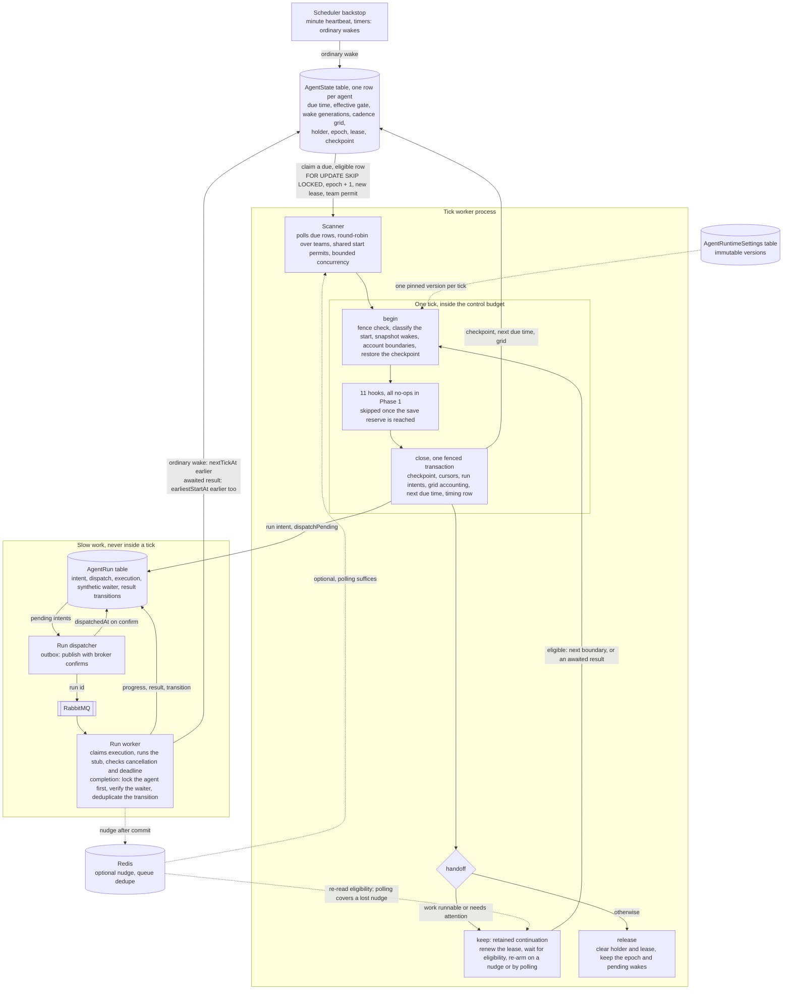

# Abe implementation plan

This plan is built phase by phase from `abe_design.md`. Each phase has its own section.

## Phase 1 - Ticks

A worker claims an agent row and runs a bounded tick through eleven hooks. It saves a checkpoint, then retains a
continuation or hands the agent back. Run workers do slow work separately. Ordinary wakes preserve the cadence gate. An
**awaited result** is a run completion that a registered task step is waiting for, with a current durable dependency
under design 1.4; Phase 1 represents that dependency with a synthetic waiter. Once verified, it makes a tick eligible
without waiting for the boundary. An **additional start** is a tick started by an awaited result before the next cadence
boundary. An **ordinary start** is a tick started at a cadence boundary or by an ordinary wake from idleness.

A committed nudge tells a retained owner to re-read eligibility and join the shared permit queue. Polling covers lost
nudges. The scheduler backstop supplies ordinary wakes for heartbeats and timers. Every start still needs ownership, an
execution slot and a shared team permit, and ticks never overlap.

The diagram shows the Phase 1 parts and what flows between them. Cylinders are tables in PostgreSQL, except Redis.
Dotted arrows are optional.



### Terms

- A **holder** is the worker process identity recorded on an agent row. An **epoch** is a counter on the row that
  increases on each claim. A **lease** is the holder's ownership of the row until `leaseUntil`; renewing it extends that
  time.
- A **fence** is the check of holder, epoch, and unexpired lease before a state write. A **fenced** write is made only
  if that check passes; if it fails, the transaction rolls back.
- A **continuation** is the worker keeping an agent after a tick instead of releasing it: it holds the lease, renews it,
  and sleeps until the next allowed start. The plan also calls this a **retained continuation** or a lightweight
  continuation.
- A **handoff** is the locked step at the end of a tick that decides whether the current owner keeps the agent or
  releases it, after checking outstanding work and supervision. The plan also calls it the **exit handoff**.
- An **intent** is a run record committed before dispatch. The run row is also the durable **outbox** from which the
  dispatcher publishes a job.
- A **wake** is a durable request to bring an agent forward. A **nudge** is an optional pubsub message sent after that
  request commits.
- **Ordinary cadence** is the fixed spacing of ordinary boundaries. An **active segment** starts with the first tick
  after an ordinary wake from idleness. A **cadence segment** records an anchor, cadence and accounting cursor; a
  cadence setting change starts a new segment. An additional start alone neither starts nor re-anchors a segment. A
  **missed start** is an unserved boundary that passed.
- The **earliest-start check** enforces effective `earliestStartAt`. The next ordinary boundary is stored separately. A
  verified awaited result can lower the effective gate without changing that boundary.
- An **eligible result** is an awaited result whose current registration and unspent transition entitlement have been
  verified durably. **Wake generations** are increasing counters per cause. The two causes are the ordinary cause and
  the continuation cause (`continuationWake`), so called because it continues the agent's own work; a start from it is
  classified `awaited_result`. Begin acknowledges only its snapshot. A result transition has a stable identity, so
  duplicate delivery cannot grant another additional start.
- **Live search** is the design's bounded read-and-decide run over a tool. **Simulation search** is its existing search
  over an isolated simulator (design 7.10). Neither search implementation belongs to Phase 1.
- The **control budget** bounds the control work of a tick, including saving. The **save reserve** is the part held back
  for saving.
- A **checkpoint envelope** holds a revision, update time, and opaque contents.
- The **scanner** polls for due agent rows. The **tick coordinator** runs the tick lifecycle and hooks. A **run worker**
  executes slow work. The scheduler **backstop** turns a due heartbeat or timer into a wake update. A **stub** is the
  synthetic run implementation used in Phase 1.

### Scope and design constraints

Build the tick structure: durable agent rows, a worker pool, bounded ticks, checkpoints and safe handoffs. Add eleven
named hooks, a generic slow-run contract, durable wakes in two classes, conditional `earliestStartAt` reduction, an
unchanged ordinary cadence grid with durable accounting, retained-continuation nudges with polling fallback, a scheduler
backstop, tests, timing traces and metrics. Use synthetic waiter registrations and runs before any hook gains behaviour.
All numerical settings, latency targets and capacity estimates below are starting defaults to test.

Perception is out of scope: all of Chapter 2, including the receptor, screening, interpretation and glances. Attention,
recall, memory, deliberation, procedures, tools, the notification tray and sleep are also out. Do not build tasks, live
search, simulation search, delegated child operations, the `evaluate` job, drives, identity refresh, observation stores
or a debugger UI. Keep checkpoint contents opaque. Every excluded tick step remains a named no-op that records its
invocation. Synthetic registrations represent current and stale dependencies without implementing tasks. Stub runs
exercise dispatch, eligibility and recovery without calling a model or tool.

The design sets these Phase 1 constraints:

- **1.4 — Budget and cadence.** Allow 1,000 ms of control work, including a 200 ms saving reserve, with ordinary
  boundaries 5,000 ms apart, scheduled from a fixed grid, not from the previous finish. These remain defaults to test.
  Verified awaited results permit additional starts without waiting for the boundary or moving the grid. Every start
  needs a valid lease, execution slot and shared team permit. The budget bounds duration, not rate. Record missed
  boundaries; never replay empty ticks or overlap valid ticks.
- **3.4 — Checkpoint envelope.** Persist a revision, update time, and opaque contents. Restore the last committed
  contents after restart or ordinary idleness. Phase 1 does not interpret slots, versions, priming, or activation.
- **8.1 — Consistency and recovery.** Keep the checkpoint consistent with committed cursors and intents. Persist an
  intent before dispatch. “Committed work is recovered, unfinished work replays safely.” Test this with synthetic cursor
  and intent records. Do not implement observation cursors or task changes.
- **8.1 — Unknown runs.** If contact with an executing run is lost, leave its outcome `unknown`. A missing result is not
  success or permission to repeat an unknown effect.
- **8.5 and 10.3 — Ownership.** Persist run records before dispatch. The run worker owns slow execution, cancellation
  checks, progress, and its execution timeout. The tick never waits for a slow result.
- **8.5 and 10.3 — Continuation and exit.** Keep the agent’s loop scheduled while work is runnable or needs attention
  before the next scheduler fire. A process-held call keeps its owning job alive. Exit only when outstanding work and
  supervision each have a durable owner.
- **10.3 — Lease and wake.** Use a holder, increasing epoch, and expiry. Renew a retained lease. Check the holder,
  epoch, and unexpired lease before state writes. Coordinate the final work check, wake check, and release. Use the
  minute heartbeat as a backstop.
- **10.1 — Timing trace.** Record `scheduledAt`, `missedStarts`, `durationMs`, `controlBudgetMs`, `saveReserveMs`,
  `overrunMs`, and `runtimeSettingsVersion`, and, from round fifteen, `startCause` and `eligibilityAt`.
- **6.6 — Settings.** Put timing and execution limits in immutable, versioned runtime settings. They do not belong in
  identity.
- **11.1 and 11.2 — Proof before behaviour.** Use a fake clock and failure injection. Phase 1 delivers the tick portion
  of M1, not the whole milestone.

Two further decisions:

- Keep the pending-wake flag and locked handoff, with separate cause generations, earliest timestamps and durable result
  entitlements. `min(nextTickAt, now)` alone cannot preserve a racing wake or lower the effective start gate safely.
- Sections 8.5 and 10.3 require continued ownership while work remains runnable. Keep a lightweight continuation under a
  renewed lease when needed. Do not release after every active tick unconditionally. No agent gets a dedicated process.

### Data model

#### Model conventions

Use `EldonModel` for schemas, ordinary reads, ACLs, and transactional writes. Use explicit SQL for claims and
conditional lease writes. Today, the base model supplies `_id`, `active`, `created`, `updated`, and ACL fields.
`register(eldonDb)` builds a table specification from the model’s `name` and `schema`. It registers generated
`createTableSql(...)` statements and expected columns, then makes the model available through `EldonModel.byName`.

Declare each Phase 1 model in a `.model.server.ts` file with
`new EldonModel<Interface, ClientShape>({ name, schema, toClient, ... })`. Follow
`h/core/models/schedule.model.server.ts` and `eldon3/apps/abe/core/models/agent_task_run.model.server.ts`. Extend
`EldonModelApi` in each interface. Use inherited `created` and `updated` row timestamps; do not add `createdAt` or
`updatedAt`. Use the model’s `tableName`; do not add a separate table-name or `createSql` property to the model
declaration. SQL must use the generated column names. Ordinary fields keep their spelling, such as `"nextTickAt"`; ACL
fields have mappings such as `"acl_team_id"`. The explicit `teamId` below is a runtime field, not that ACL column.

Choose `internal: true` for these Phase 1 runtime models, with an id-only `toClient`. Platform creates use
`{ internalObject: true }`. Platform queries and mutations use `{ skipAclCheck: true }`, with a reason at the call site.
Passing a requester does not give an internal model a read policy. Check agent/team bindings explicitly. Models exposed
to requesters later need declared `permissions`, as `agentTaskRunModel` has today.

Phase 1 transactions must use the session that the model API accepts. Today, `EldonDb.withTransaction(callback)` checks
out a `pg.PoolClient` and begins a transaction. It commits a successful callback result, rolls back returned or thrown
errors, and releases the client. Raw SQL uses `eldonDb.query({ text, values }, { client })`. Model methods take an
`EldonTransactionSession` in their options, not a raw `pgClient`.

For work that mixes model calls and SQL, use `model.startTransaction(async (session) => ...)`, which wraps
`withTransaction`. Pass `{ session, ...accessOptions }` to every model call. Use `session.client` for SQL. Sessions must
belong to the same database. The callback’s transaction closes them when it ends.

Map TypeScript dates to `timestamptz`, opaque values to `jsonb`, and epochs to PostgreSQL `bigint`. Represent epochs as
decimal strings in TypeScript to avoid integer precision loss. These storage choices remain Phase 1 choices. Declare
ordinary fields with `DbFieldType.DATE`, `MIXED`, `STRING`, `BOOLEAN`, and `NUMBER`. Declare agent references with
`DbFieldType.OBJECT_ID` and `ref: 'Agent'`. Make sure the table compiler, hydration, and schema validation support the
chosen epoch mapping; do not assume a `STRING` or `NUMBER` declaration already provides a lossless `bigint` mapping.
Preserve checkpoint JSON contents without interpretation. If the envelope is stored as one JSON value, explicitly encode
and restore its timestamp.

#### AgentState — new, one row per agent

```typescript
type CheckpointEnvelope = {
    revision: number
    updatedAt: Date
    contents: unknown // JSON only; preserved without interpretation
}

interface AgentState extends EldonModelApi {
    _id: string
    agentId: string
    teamId: string
    enabled: boolean

    nextTickAt: Date
    wakePending: boolean
    wakeRequestedAt: Date | null // earliest unacknowledged wake
    ordinaryWake: { generation: string; acknowledgedGeneration: string; earliestAt: Date | null }
    continuationWake: { generation: string; acknowledgedGeneration: string; earliestAt: Date | null }

    cadence: {
        segmentId: string
        anchor: Date
        cadenceMs: number
        accountedThrough: Date | null
        nextBoundaryAt: Date
        active: boolean // false once ordinary idleness ends the segment; the whole object is null before any segment
    } | null
    missedStartRanges: {
        segmentId: string
        anchor: Date
        cadenceMs: number
        first: Date
        last: Date
        reportedThrough: Date | null
    }[]

    syntheticWaiters: {
        id: string
        runId: string
        stepId: string
        revision: string
        generation: string
        destination: string
        current: boolean
        handledTransitions: string[]
    }[] // fixtures only; registration and invalidation lock this agent row

    holder: string | null // unique worker process identity
    epoch: string
    leaseUntil: Date | null

    earliestStartAt: Date | null // effective gate: null while idle with no pending awaited result; a verified completion may lower it without changing cadence.nextBoundaryAt
    nextTimerAt: Date | null // generic timer boundary, not an expectation
    heartbeatAt: Date

    runtimeSettingsVersion: string
    checkpoint: CheckpointEnvelope

    attempt: {
        id: string
        scheduledAt: Date
        startedAt: Date
        runtimeSettingsVersion: string
        startCause: 'cadence' | 'idle_wake' | 'awaited_result'
        eligibilityAt: Date
        ordinaryWakeGeneration: string
        continuationWakeGeneration: string
        ordinaryWakeEarliestAt: Date | null // snapshotted at Begin, for latency by cause
        continuationWakeEarliestAt: Date | null
        resultTransitions: { runId: string; transitionId: string }[]
        cadenceSegmentId: string | null
        servedBoundaryAt: Date | null
        teamPermitId: string
    } | null

    lastClosedTickId: string | null
}
```

`active` is the inherited soft-delete flag: deleting the row sets it false. `enabled` is the pause switch: a disabled
agent keeps its row and state but is never claimed. The claim requires both.

Field ownership:

| Fields                                                                                            | Writer                                                                                                                            |
| :------------------------------------------------------------------------------------------------ | :-------------------------------------------------------------------------------------------------------------------------------- |
| Identity, team, initial checkpoint, initial due times, empty wake states, cadence and waiter list | Provisioning                                                                                                                      |
| `enabled`, `runtimeSettingsVersion`                                                               | Platform configuration                                                                                                            |
| `holder`, `epoch`, `leaseUntil`                                                                   | Claim, renewal, and release code                                                                                                  |
| `wakePending`, `wakeRequestedAt`, cause generations and timestamps                                | Trusted wake helper sets them; Begin acknowledges snapshots; Close removes consumed-result entitlements and recomputes aggregates |
| `nextTickAt`                                                                                      | Wake producers can move it earlier; the tick sets it through the handoff                                                          |
| `earliestStartAt`                                                                                 | Fenced coordinator computes the gate; verified completion transaction may lower it                                                |
| Synthetic waiter registrations and generations                                                    | Fixture registration and invalidation under the agent-first transaction; Close marks handled transitions                          |
| Cadence, heartbeat, attempt, last closed tick                                                     | Fenced tick coordinator                                                                                                           |
| `nextTimerAt`                                                                                     | Generic timer registration and acknowledgement                                                                                    |
| Checkpoint envelope                                                                               | Fenced checkpoint transaction                                                                                                     |
| `created`, `updated`                                                                              | Model write helpers; explicit SQL maintains `updated` with database time                                                          |

A timer registration locks the agent row and moves its due time earlier in the same transaction. Timer acknowledgement
cannot erase a timer registered concurrently. Phase 1 exposes this contract to fixtures only.

Add:

- A unique index on `"agentId"`.
- A partial index on `("nextTickAt", "leaseUntil", "_id")` for active, enabled rows.
- A partial index on `("teamId", "nextTickAt", "leaseUntil", "_id")` for team-scoped claims of active, enabled rows.
- An index on `"heartbeatAt"` for active, enabled rows.

Treat the recommended composite index as a starting point, not proof of a cheap query. Check plans with many future
rows, held leases, and due rows.

All existing fields and indexes remain. Store wake generations losslessly: decimal strings inside the jsonb cause
objects, advanced with PostgreSQL `bigint` arithmetic, under the same lossless rule as the epoch mapping. `wakePending`
and `wakeRequestedAt` remain aggregate compatibility fields derived from both causes. `earliestStartAt` is the effective
gate; `cadence.nextBoundaryAt` is the independent ordinary boundary. `missedStartRanges` retains exact unreported
accounting across segment changes and recovery without allocating one entry per missed boundary.

#### AgentRun — new, generic execution record and dispatch intent

```typescript
interface AgentRun extends EldonModelApi {
    _id: string
    agentId: string
    teamId: string
    requesterId: string
    kind: string // only "stub" is registered in Phase 1
    purpose: string
    inputs: { id: string; version: string | number }[]
    destination: string // opaque durable destination
    waiter: {
        registrationId: string
        stepId: string
        revision: string
        generation: string
        destination: string
    } | null
    wakeDisposition: 'ordinary' | 'awaited_result' | 'obsolete' // the latest transition's disposition
    resultTransitions: {
        id: string // stable transition identity, unique within this run
        receivedAt: Date
        waiterGeneration: string | null
        wakeDisposition: 'ordinary' | 'awaited_result' | 'obsolete'
        eligibilityAt: Date | null
        wakeGeneration: string | null
        entitlement: 'none' | 'pending' | 'spent' | 'consumed' | 'obsolete'
        acknowledgedByTickId: string | null
    }[]
    deadline: Date

    originTickId: string
    originAgentEpoch: string
    idempotencyKey: string

    status: 'intent' | 'queued' | 'running' | 'completed' | 'cancelled' | 'failed' | 'unknown'

    dispatchPending: boolean
    dispatchRetryAt: Date | null
    dispatchAttempts: number

    executionHolder: string | null
    executionEpoch: string
    executionLeaseUntil: Date | null

    cancelRequested: boolean
    cancelReason: string | null
    progressRef: string | null
    resultRef: string | null

    dispatchedAt: Date | null
    startedAt: Date | null
    externalCompletedAt: Date | null
    observedAt: Date | null
    consumedAt: Date | null
}
```

The tick creates the immutable intent fields. The dispatcher owns dispatch bookkeeping. The run worker owns execution,
saved progress, and result fields under its execution fence. The tick coordinator records consumption only when the
synthetic result’s consequences commit.

The waiter linkage and wake disposition are trusted runtime metadata, never values accepted from stub result content.
Fixture registration may attach a waiter to an adequate existing run atomically under the agent-first lock order. The
current registration must match the run, destination, step revision and dependency generation. The completion helper
checks it again before granting an entitlement. Failure, cancellation or `unknown` may qualify when the registered step
must handle that transition. A registration invalidated or superseded before completion grants no privilege.

Persist each result transition and its disposition once. A duplicate transition returns the existing outcome without
incrementing wake generations, lowering the gate again or issuing a new entitlement. A later distinct outcome, such as
resolution of `unknown`, is checked against a still-current waiter before qualifying. Consuming a result marks its
relevant transitions handled. A spent entitlement cannot start another additional tick merely because its result has not
yet been consumed; that result remains ordinary runnable work.

Production tasks later replace the synthetic registration source without changing this contract. Search-child completion
will wake its parent executor without opening the tick gate; Phase 1 implements no such executor.

Add a unique index on `("agentId", "idempotencyKey")`, an index for pending dispatch by retry time, an index on
`("agentId", "status")`, and an index for expired execution leases.

`dispatchedAt` means confirmed publication. `externalCompletedAt` means execution finished, when known. `observedAt`
means the runtime received the result. `consumedAt` means its consequences committed. Do not collapse these times.

#### AgentTick — new, timing only

```typescript
interface AgentTick extends EldonModelApi {
    _id: string
    agentId: string
    at: Date
    scheduledAt: Date
    missedStarts: Date[]
    startCause: 'cadence' | 'idle_wake' | 'awaited_result'
    eligibilityAt: Date
    ordinaryWakeGeneration: string
    continuationWakeGeneration: string
    ordinaryWakeEarliestAt: Date | null
    continuationWakeEarliestAt: Date | null
    cadenceSegmentId: string | null
    servedBoundaryAt: Date | null
    durationMs: number | null
    controlBudgetMs: number
    saveReserveMs: number
    overrunMs: number | null
    runtimeSettingsVersion: string
}
```

Add an index on `("agentId", "at")`. Use the tick id as the unique key. Null duration and overrun mean the process died
before it reported its final measurement. Never invent a monotonic duration from wall-clock timestamps.

Do not add perception, memory, action, or model fields. Record hook invocations in structured operational logs and
counters.

#### AgentRuntimeSettings — new, immutable versions

```typescript
interface AgentRuntimeSettings extends EldonModelApi {
    _id: string // version

    controlBudgetMs: number // 1_000
    saveReserveMs: number // 200
    activeCadenceMs: number // 5_000
    scanIntervalMs: number // 200
    heartbeatIntervalMs: number // 60_000
    leaseTtlMs: number // 15_000
    leaseRenewIntervalMs: number // 5_000

    maxConcurrentTicksPerAgent: 1
    maxConcurrentRunsPerAgent: number // 4
    maxConcurrentTicksPerWorker: number // 2
    maxTickStartsPerTeamPerSecond: number // 250

    runTimeoutMs: number // 300_000
    runPrefetch: number // 1
}
```

Validate positive durations and `saveReserveMs < controlBudgetMs`. Also validate that the lease leaves enough time for
renewal and saving. The single-tick limit is an invariant, not a tuning option.

Load one immutable settings version for each tick. Apply a settings change at the next tick boundary. A cadence change
starts a new cadence segment; it must not reinterpret earlier missed starts.

`maxTickStartsPerTeamPerSecond` covers cadence, idle-wake and additional starts, including retained continuations. Pin
one version per tick. A changed cadence is applied only at Begin after prior-segment accounting is settled; an awaited
result alone does not create a settings change or re-anchor the segment.

Each new model registers generated table-creation SQL and needs a deployment migration, including its composite and
partial indexes. `EldonDb.ensureSchema()` creates missing local tables in development and test. Deployed environments
validate existing schemas. Local table creation is not a deployment mechanism. Deploy migrations before enabling
workers.

### Components

| Component              | Inputs and outputs                                                                          | Responsibility and boundary                                                                                                                                 |
| :--------------------- | :------------------------------------------------------------------------------------------ | :---------------------------------------------------------------------------------------------------------------------------------------------------------- |
| Tick worker            | Due rows → claimed ticks and scheduled continuations                                        | Polls PostgreSQL, applies team fairness, limits local concurrency, and renews retained leases. Never runs slow bodies.                                      |
| Tick coordinator       | Claim, settings, checkpoint → committed checkpoint and next due time                        | Runs lifecycle code and the eleven hooks. Never calls a model, tool, or perception service.                                                                 |
| Run dispatcher         | Committed run intents → RabbitMQ jobs                                                       | Publishes with confirms and retries through a new confirm-backed queue path. Never creates an intent after publication.                                     |
| Run worker             | Run id and hydrated job context → progress, result, durable wake                            | Executes only the registered stub. Never writes working memory or advances agent steps.                                                                     |
| Wake helper            | Agent id, trusted cause, transition identity and caller's transaction → durable eligibility | Checks waiter registration, deduplicates transitions, maintains cause generations and conditionally lowers the effective gate. Pubsub is notification only. |
| Scheduler backstop     | Due heartbeat or timer → wake update                                                        | Uses existing scheduler dispatch and retry machinery. Never drives the active cadence.                                                                      |
| Exit handoff           | Current lease and durable work state → continuation or release                              | Checks ownership and work under the row lock. Never releases first and checks later.                                                                        |
| Continuation scheduler | Retained rows, nudges and polling → shared permit queue                                     | Re-reads durable eligibility, re-arms waits, renews leases and competes fairly with scanned rows. Never starts from a nudge alone.                          |

Put the generic claim-loop lifecycle, clock interface, bounded execution helper, and lease helper in `h/core`. They know
nothing about agents or cognition. Keep the `agent_state` SQL adapter, models, tick hooks, scheduling rules, and job
registrations in `eldon3/apps/abe`.

#### Worker and scheduler wiring

Phase 1 needs a scanner lifecycle that fits `startWorker` but can stop claims before queue teardown. Today,
`startWorker` takes `WorkerConfig.jobs` and optional `schedules`. It registers jobs in parallel. Before attaching each
job’s listener, it runs that job’s argument-free `onServerStart()` and stores the returned data as
`QueueCtrlParams.serverData`. `onServerStop(serverData)` receives the same resource. Startup failures are logged without
aborting job registration.

Use `startWorker` to start the scanner once per worker process and stop it during shutdown. The scanner is not a
long-running RabbitMQ delivery. Give one designated registration ownership of its lifecycle. Because a startup failure
does not abort job registration, scanner startup must report an unhealthy state and prevent claims if its required
resources are unavailable. Today, the shutdown path closes the queue manager before it invokes job stop hooks, so add
lifecycle support that stops claims and drains the new dispatcher before queue teardown. Then close the scanner and
retained continuations.

Supply scanner and dispatcher resources explicitly through bootstrap wiring. Today, `QueueCtrlParams` provides
`aiEngine`, optional `pubsub` and `scheduler`, `sendToQueue`, `broadcastMessageToUser`, `sendToAppInstance`, and
`serverData`. It does not provide a database client or the queue manager. Do not assume lifecycle callbacks receive
these parameters.

Keep a process-local registry of retained agent ids and their lease identities. Route committed nudges to the owning
continuation where available; a stale or duplicate nudge only triggers a durable re-read. A nudge arriving before the
wait is armed must still cause re-arming from the row's effective eligibility.

Poll retained rows as well as released candidates, using the configured `scanIntervalMs` as the initial fallback
interval to test. Batch these reads within worker limits. A scanner that filters out every leased row cannot recover
lost nudges for retained owners. Both sources submit eligible agents to the same fair permit queue. A running tick
cannot be re-entered; its completion nudge remains represented by durable pending state until close.

Shutdown stops new submissions, drains bounded closes and transfers or releases responsibility under the existing
handoff. Lease renewal and run supervision remain independent of eligibility waits.

Register `tick_agent` as the bounded wake/backstop adapter. Register a separate stub-run job in `jobs.ts`, with names in
`constants.server.ts`. Export the new models through `core/shared/models.server.ts`. Include them in the worker’s
`models` array.

Declare the minute backstop through `WorkerConfig.schedules`. Use a registered job name and `EldonScheduleType.INTERVAL`
with `everyMs: 60_000`. Today, `startWorker` calls `scheduler.create` after job registration. Creation reuses an
existing active schedule matching name, payload, and owner. Ownerless declarations are system schedules. The backstop
payload and bounded scan batch remain Phase 1 configuration choices. The current Abe worker declares only the hourly
memory-consolidation schedule and does not pass `redisUrlstring`. Configure that worker option where Redis-backed
scheduler election and queue dedupe are required.

#### Tick lifecycle

The tick has this skeleton:

```text
begin
  restore the committed checkpoint
  load the pinned settings version
  establish the attempt, classify the start and acknowledge the snapshotted wakes
  reconcile generic execution ownership within the budget
  invoke beginContextHook

1.  Sense      → senseHook
2.  Perceive   → perceiveHook
3.  Predict    → predictHook
4.  Appraise   → appraiseHook
5.  Prime      → primeHook
6.  Attend     → attendHook
7.  Recall     → recallHook
8.  Select     → selectHook
9.  Act        → actHook
10. Observe    → observeHook
11. Regulate   → regulateHook

close
  commit the checkpoint and structural changes

continue
  keep the continuation scheduled, or perform the exit handoff
```

Every hook returns `no_change` and records its name, tick id, invocation, and duration. A hook skipped because the
budget is spent records `skipped_budget`. `beginContextHook` does no identity refresh, decay, drive update, or
observation catch-up.

The coordinator must save the checkpoint even when `regulateHook` is skipped. Synthetic fixture adapters exercise
intents, results, cancellation, and cursor consistency around this skeleton: they create intents, deliver results,
request cancellation, and change synthetic cursors. Production hooks remain no-ops.

### Algorithms

#### Claim

Choose a team with an available start permit. Then run this statement against the `AgentState` model’s table. Supply
parameters for the team, worker identity, and lease TTL:

```sql
WITH candidate AS (
    SELECT "_id"
    FROM "agent_state"
    WHERE "active" = true
      AND "enabled" = true
      AND "teamId" = $1
      AND "nextTickAt" <= statement_timestamp()
      AND (
          "earliestStartAt" IS NULL
          OR "earliestStartAt" <= statement_timestamp()
      )
      AND (
          "leaseUntil" IS NULL
          OR "leaseUntil" < statement_timestamp()
      )
    ORDER BY "nextTickAt", "_id"
    FOR UPDATE SKIP LOCKED
    LIMIT 1
)
UPDATE "agent_state" AS agent
SET "holder" = $2,
    "epoch" = agent."epoch" + 1,
    "leaseUntil" =
        statement_timestamp() + ($3 * interval '1 millisecond'),
    "updated" = statement_timestamp()
FROM candidate
WHERE agent."_id" = candidate."_id"
RETURNING agent.*, statement_timestamp() AS claimed_at;
```

The claim needs explicit SQL so workers can skip locked rows and use database time for the lease. Today,
`findOneAndUpdate(query, update, options)` selects one row with `FOR UPDATE` inside `withClient`, ordered by
`options.sort`, and supports `upsert` and `session`. It can perform an ordered, locked conditional update, and it can
take part in the caller’s transaction. Its selection path uses plain `FOR UPDATE`, without `SKIP LOCKED`.

Use explicit SQL for nonblocking claim selection and database-time lease expressions. A plain locking update could make
workers wait behind the same busy row. The claim acquires ownership; it does not acknowledge wakes or advance the
schedule. If the worker dies immediately, the row remains due and becomes claimable after expiry.

Keep both SQL due-time and effective-gate checks. Wake and close maintain these fields from the independent cadence
cursor and eligible result transitions; the claim must not derive a new grid from `nextTickAt`. Obtain an execution slot
and reserve a durable shared team permit before claiming. Begin consumes that reservation once for its attempt. Unused
reservations expire or are released without counting a start. Retained continuations use the same reservation path. No
new claim or retained start can bypass the team budget.

Run the statement as a short transaction. Never hold its row lock throughout a tick. No returned row means another
worker won, the team has no eligible work, or the row is still leased.

#### Begin

Start the local monotonic budget immediately before sending the claim. This makes claim latency consume budget. Start a
fresh budget before the fenced begin transaction of a retained continuation.

Lock `AgentState`, then any run rows needed for eligibility. Check holder, epoch, unexpired lease, execution slot and
the durable team permit. Recover an unfinished attempt before replacing it. Recheck effective eligibility and remove
obsolete or already consumed result entitlements before deciding to start.

Account for the old cadence segment through database `now`. If an unserved boundary is due, serve the latest due
boundary, record earlier unserved boundaries as missed, and classify this as `cadence`. Coalesce eligible result
transitions into that tick. If no boundary is due, a qualifying pending entitlement permits `awaited_result`, with
`scheduledAt` equal to its durable eligibility time. An ordinary wake from idle is `idle_wake` and starts an active
segment; when an idle agent holds both an ordinary wake and a pending entitlement, `idle_wake` wins and the entitlement
is coalesced into that tick. Record `eligibilityAt` separately from actual start time, and keep both snapshotted
earliest timestamps on the attempt and the timing row so that latency can be reported by cause. The attempt id is the
tick id.

Snapshot both wake generations, their earliest timestamps and the qualifying transitions. Persist the attempt,
classification, served boundary, accounting changes and permit consumption atomically. Acknowledge only the snapshotted
generations and mark the snapshotted entitlements spent by this attempt. Clear a cause's pending timestamp only through
that acknowledged generation. Recompute aggregate wake fields; later arrivals set pending state again.

If a cadence setting changed, finish old-segment accounting first and begin the new segment at this tick under its
pinned version. This tick must already have been eligible under the existing gate; a settings change is not a wake. A
recovery uses the persisted attempt and cursor, so it cannot spend a transition or account for a boundary twice.

Restore the checkpoint and inspect a bounded set of generic run records. Leave a healthy run owned by another worker
running. If an execution owner has expired, leave the run `unknown`. Losing the tick worker does not invalidate a
healthy run worker.

#### Budget

```text
deadline = monotonicStart + controlBudgetMs
admissionDeadline = deadline - saveReserveMs

for hook in orderedHooks:
    if leaseLost or monotonicNow >= admissionDeadline:
        record remaining hooks as skipped
        break
    invoke bounded hook
    check budget and lease again

closeAndHandoff(deadline)
```

Database operations need deadline support for this budget. Today, `EldonDb.query` accepts only a statement and optional
client. `withTransaction` accepts only its callback. Neither supplies a deadline or cancellation option.

Pass the time remaining until the deadline through the new database execution helper. Add the support needed to bound
pool acquisition, lock waits, statements, and commit waits. Do not use `Promise.race` as if it cancelled a database
write. Cancel or close the affected client. Resolve an uncertain commit before retrying.

Keep synchronous work small or make it yield in bounded pieces. A timer cannot interrupt blocked JavaScript. The budget
stops admission; it cannot guarantee that a stalled database or runtime pause ends within one second.

#### Close of tick

Use `agentStateModel.startTransaction`, backed by `EldonDb.withTransaction`, with one session and its client. Pass that
session to every participating model call. Run explicit SQL on `session.client`. Today, `findWithFixedStatement` takes
only `{ skipAclCheck: true }`. It is not the transaction path for these writes.

1. Lock the agent row.
2. Check holder, epoch, unexpired lease, and expected checkpoint revision.
3. Commit synthetic cursor changes, result consumption, and run intents.
4. Save the checkpoint with its new revision and database update time.
5. Account once for unserved cadence boundaries crossed during execution and advance timer bookkeeping. Remove
   entitlements for results consumed in step 3, including results that arrived after Begin. Preserve every unrelated
   later wake generation and its earliest timestamp.
6. Check durable runnable work, run ownership, and pending wakes.
7. Set the next due time and retain or release ownership.
8. Insert a timing row when the tick is non-empty or anomalous.
9. Set `lastClosedTickId`, clear `attempt`, and commit.

Use this fenced transaction boundary for every tick-owned mutation. If any of those checks fails, roll back all
dependent writes, not just `AgentState`. Return an error from the transaction callback when the fence fails. A
successful callback result with no matching row does not itself trigger rollback. Apply the same rule to any future
early durable write. Keep its checkpoint consistent with what that write committed.

Do not use a bare `$set` containing old copies of `nextTickAt`, `earliestStartAt` or wake state. Recompute effective
eligibility under the lock from the ordinary grid and surviving pending result entitlements. A racing completion must
retain both its wake and early eligibility. A same-tick consumed result must leave no stale entitlement or falsely
lowered gate. A spent but unconsumed result remains ordinary runnable work, without a second additional-start grant.

#### Wake

Store the event or result and its wake in one PostgreSQL transaction. Lock the agent first, then the run and synthetic
registration state. Use database time. For a completion, verify the execution fence and registration, and insert the
stable result transition only if it is new. Return the recorded disposition for duplicates without performing the wake
update again.

Ordinary events and unawaited background completions select the ordinary cause. A completion selects continuation only
when its current waiter matches the run, task-step fixture revision, dependency generation and destination, and the
transition still needs handling. Obsolete completions remain recorded without continuation privilege. An external reply
is always ordinary. Neither a payload nor a model supplies the cause.

The SQL below runs only after that verification and deduplication, while the agent lock is held. `$2` is the trusted
boolean indicating a qualifying awaited result. The JSON cause counters are decimal strings, advanced with PostgreSQL
`bigint` arithmetic. The same transaction writes the assigned generation and eligibility timestamp into the run's
transition record. Ordinary wakes do not modify `earliestStartAt`:

```sql
WITH wake_time AS (
    SELECT statement_timestamp() AS at
)
UPDATE "agent_state" AS agent
SET "nextTickAt" = LEAST(agent."nextTickAt", wake_time.at),
    "earliestStartAt" = CASE
        WHEN $2::boolean THEN
            CASE
                WHEN agent."earliestStartAt" IS NULL THEN wake_time.at
                ELSE LEAST(agent."earliestStartAt", wake_time.at)
            END
        ELSE agent."earliestStartAt"
    END,
    "wakePending" = true,
    "wakeRequestedAt" = CASE
        WHEN agent."wakeRequestedAt" IS NULL THEN wake_time.at
        ELSE LEAST(agent."wakeRequestedAt", wake_time.at)
    END,
    "ordinaryWake" = CASE
        WHEN $2::boolean THEN agent."ordinaryWake"
        ELSE agent."ordinaryWake" || jsonb_build_object(
            'generation',
            (((agent."ordinaryWake" ->> 'generation')::bigint + 1)::text),
            'earliestAt',
            LEAST(
                COALESCE((agent."ordinaryWake" ->> 'earliestAt')::timestamptz, wake_time.at),
                wake_time.at
            )
        )
    END,
    "continuationWake" = CASE
        WHEN NOT $2::boolean THEN agent."continuationWake"
        ELSE agent."continuationWake" || jsonb_build_object(
            'generation',
            (((agent."continuationWake" ->> 'generation')::bigint + 1)::text),
            'earliestAt',
            LEAST(
                COALESCE((agent."continuationWake" ->> 'earliestAt')::timestamptz, wake_time.at),
                wake_time.at
            )
        )
    END,
    "updated" = wake_time.at
FROM wake_time
WHERE agent."agentId" = $1
  AND agent."active" = true
RETURNING agent.*;
```

Wakes coalesce by cause with the earliest unacknowledged timestamp; do not enqueue a tick per arrival. Each newly
qualifying result transition contributes at most one entitlement. Begin can coalesce several into one start. The
ordinary boundary and cadence cursor are untouched by this update.

Publish an optional `EldonPubSub` nudge only after commit. It asks a scanner or retained owner to re-read eligibility
and enter the normal permit queue; it does not start a tick. Polling must cover retained owners as well as released
rows. The nudge channel and publication adapter remain Phase 1 choices; the available method signatures do not establish
a publish/subscribe contract.

Redis coordination is optional and does not own wake correctness. Today, `EldonPubSub` provides
`setIfAbsentWithTTL(key, value, ttlSec)`, `setWithTTL`, `get`, `delete`, `claimOwnership`, `deleteIfEquals`, and
`refreshIfEquals`, plus `incrementWithTTL` for counters. Acquisition returns `wasSet`; conditional renewal returns
`refreshed`; conditional deletion returns `removed`. These primitives can support optional Redis coordination. They do
not replace the PostgreSQL holder, epoch, expiry, and fenced state transaction.

During an active segment, ordinary wakes alone cannot create additional starts. Verified awaited results lower the
effective gate without waiting for the boundary. Both claim and retained Begin enforce that gate and the shared permit
budget. A completion during a running tick waits for close. An ordinary wake from idleness starts a new segment when
capacity and permits allow. These rules remove intentional cadence waiting, not other execution delays.

#### Release and handoff

Under the close transaction’s row lock, check in this order:

1. The lease and checkpoint revision still match.
2. The tick owns no slow call.
3. Every outstanding run has a durable dispatch retry, execution owner, or recovery deadline.
4. Runnable structural work and any pending wake are accounted for.
5. The next timer, earliest start, and heartbeat have an owner.

Keep a lightweight continuation when work is runnable or something needs attention before the scheduler backstop. The
worker waits until effective eligibility, renews the lease separately and re-arms on a committed nudge or polling
result. Waiting occupies no tick execution slot. Becoming eligible submits the agent to the same fair permit queue as
scanned rows. A nudge neither bypasses permits nor re-enters a running tick.

Otherwise, save the idle due time and clear `holder` and `leaseUntil` in the same transaction. Keep the epoch.

Recompute both cause states after result consumption. Preserve every later ordinary wake and every unspent qualifying
result entitlement. If pending state remains, set `nextTickAt` to the earlier of its durable request time and computed
due time. Compute `earliestStartAt` from the ordinary boundary and earliest surviving result entitlement. With no
pending state, use the computed due time and gate. Never clear unrelated wake generations at close; removing an
entitlement whose result was consumed is not acknowledgement of other arrivals.

If a wake arrives before the row lock, the handoff sees it. If it arrives while blocked behind the lock, it updates the
committed row after the handoff. That update either nudges the retained owner or leaves a released row due for the
scanner. Neither path depends on a successful enqueue.

#### Next due time and missed starts

- **Idle:** use the earliest generic timer, supervision boundary or heartbeat. Keep any result entitlement and its
  eligibility durable. Ordinary idleness ends active cadence accounting at the locked handoff.
- **Ordinary wake from idle:** start an active segment at the tick's actual Begin time. An awaited-result start alone
  does not start or re-anchor a segment; without an active grid, it uses its result eligibility and leaves ordinary
  timer and heartbeat scheduling intact.
- **Active Begin:** if an unserved boundary is due, serve the latest due boundary and record earlier unserved boundaries
  as missed. This is an ordinary cadence start, even if an awaited result also enabled it.
- **Additional Begin:** with no due ordinary boundary, use the earliest qualifying unspent result eligibility as
  `scheduledAt`. Spend the snapshotted entitlements without changing the anchor or next ordinary boundary.
- **Close:** mark every unserved boundary crossed during execution missed and advance the cursor once. Schedule the
  first future boundary unless another qualifying completion is pending. Retain ordinary wake timestamps without
  allowing them to lower the active cadence gate.
- **Settings change:** account for the old segment before starting the new cadence at an eligible Begin under the new
  pinned version. Preserve old missed ranges; never reinterpret them using the new cadence.

For example, if the next start was due at 10 seconds and the worker can start only at 22 seconds, run the 20-second tick
and record 10 and 15 seconds as missed. Do not run three ticks.

With illustrative boundaries at 0, 5 and 10 seconds, an additional tick from 2 to 3 leaves 5 next. One from 4.8 to 5.2
records 5 as missed and leaves 10 next. A completion pending at that close may enable another additional start, but does
not erase the missed boundary or move the grid. At a due boundary, coalesce continuation eligibility into the ordinary
tick.

Persist cadence accounting with the attempt and close transaction so crashes do not count the same gap twice. A long
outage must not make the coordinator allocate an unbounded array inside the control budget. Keep a durable record of the
exact cadence segment and of the range of missed starts not yet reported. Write that range to timing-only traces in
bounded batches as `missedStarts`. Clear the stored range only after those batches have been written.

Do not use the scheduler’s interval advancement for active tick cadence. For ordinary jitter, the scheduler advances
from the previous due time. When a delay exceeds one interval, it collapses the delay to `now + everyMs`. Do not reuse
`computeNextRunAt` for the active tick cadence.

#### Run dispatch and result

Use the run row as the durable outbox:

1. Commit a run in `intent` with `dispatchPending = true`.
2. A separate dispatcher publishes its id to the registered RabbitMQ job.
3. On publisher confirmation, record dispatch and clear the pending flag.
4. A worker validates the payload, hydrated requester and team, and the run’s agent/team binding.
5. Atomically claim execution. Duplicate deliveries cannot claim an already owned or terminal run.
6. Execute the stub, checking cancellation and deadline between bounded chunks.
7. Lock the agent, then the run. Persist the new result transition, verify its current synthetic waiter and assign its
   trusted wake disposition in one transaction. A qualifying awaited result lowers both due time and effective start
   gate; an ordinary completion lowers only due time. Duplicate transitions issue no new entitlement.
8. A later tick commits synthetic result consumption and `consumedAt`.

The outbox needs a new publication path to distinguish a broker confirmation from a local send. Today,
`EldonQueueManager.send(queueName, envelope, { sendToQueueMaxRetries })` uses an ordinary `amqp.Channel`, sets
`persistent: true`, and writes `x-max-retries`. It returns after `channel.sendToQueue`; it does not wait for broker
confirmation. Its boolean result describes buffer backpressure, not confirmed publication. A false return does not prove
the message was never sent.

Add a confirm-backed publication path in `h/core/library/database/eldon_queue.ts` for the outbox. Keeping confirmed
publication as the meaning of `dispatchedAt` is a Phase 1 choice, and it requires this change.

The dispatcher must keep publication retries in the durable outbox. Today, the `sendToQueueMaxRetries` option defaults
to zero and is carried in the message header as `x-max-retries`; it is not a retry loop around the publisher call.
`QueueCtrlParams.sendToQueue(name, data, context)` checks requester quota and accepts `requester`, `teamid`, and
`skipQuotaCheck`. It then constructs the envelope with `created: Date.now()`. It does not expose an idempotency key,
retry count, or confirm option.

Wire the dispatcher to the new publication path explicitly.

Queue envelopes carry `data`, a typed `requester: Principal`, `teamid`, `created`, and an optional `idempotencyKey`. A
requester id alone cannot construct a principal. Establish its actor type from trusted provisioning or registered
identity records. Require both requester and team identity on stub-run messages.

The handler must still check the run binding after job hydration. Today, `startWorker` loads `jobInfo.principal` and
`jobInfo.team` when both `requester` and `teamid` are present. It rejects missing identities or invalid membership, then
calls the handler. User requesters load through `userModel`; other actors load through
`EldonModel.byName(requester.type)`.

Do not rely on queue dedupe for execution correctness. Today,
`listen(queueName, callback, { prefetch, payloadSchema, pubsub })` registers the consumer and defaults to prefetch one.
The queue’s one-hour Redis dedupe covers duplicate initial deliveries with an idempotency key. Retries bypass it, and
expiration permits later deliveries. It is not durable execution dedupe.

Declare a payload schema for the stub’s run id. When a transaction needs both the agent row and associated run rows,
lock the agent row first.

A crash between publication and confirmation can cause redelivery. PostgreSQL run state provides durable dedupe; the
queue listener’s one-hour Redis dedupe does not provide execution correctness.

Give run execution its own fence, because it must survive changes to the agent lease. The origin agent epoch records
which valid intent authorised dispatch. A later tick epoch does not invalidate an independently owned result. Run
workers may write only their own execution records and wake requests.

A valid completion's waiter is checked against the current registration, not rejected solely because `originAgentEpoch`
differs from the current agent epoch. The run execution fence remains authoritative for that run. Stale registrations
keep their results recorded without continuation privilege. Cancellation, failure and `unknown` transitions qualify only
when the current synthetic waiting step must handle them.

Later live-search execution needs a bounded parent authorisation and the shared runner for every child call. Each child
must atomically validate its basis and persist its intent, then pass current scope, task and ancestor revisions, policy,
grants, authorisation tuple and lease checks. Takeover must adopt or renew delegated execution authority before further
child dispatch. Search workers cannot write working memory or advance task steps. These are later-phase prerequisites,
not an extension of Phase 1's stub worker.

Use `prefetch: 1` and a job timeout aligned with the run deadline. Today, `startWorker` wraps handlers in
`withTimeout(jobConfig.timeoutMs)`. That wrapper does not establish the run’s durable cancellation or execution-lease
protocol. The stub owns its deadline and cancellation checks, made between bounded chunks. It supports delayed
completion, saved progress, cancellation, failure, and lost-response fixtures. No model or tool implementation is
registered.

#### Overrun and lease loss

On overrun, stop admitting work and stop renewing that attempt’s lease. While ownership remains valid, make a bounded
close attempt. Record `max(0, durationMs - controlBudgetMs)`. If close cannot finish, retain the last committed
checkpoint and let ownership expire.

On lease loss, stop immediately. Do not dispatch or retry a state write with the old epoch. Discard local changes and
let the next owner recover durable work.

Epochs prevent stale effects; they cannot stop a paused process from later resuming CPU execution. All resumed code must
check its fence before useful work. “No overlap” means one valid owner and no concurrent accepted agent mutations.

### Failure handling

| Failure                                                   | Required behaviour                                                                                                                                                                                                              |
| :-------------------------------------------------------- | :------------------------------------------------------------------------------------------------------------------------------------------------------------------------------------------------------------------------------ |
| Crash before checkpoint                                   | Restore the prior checkpoint. Replay only unfinished structural work with stable ids. Recover the unfinished attempt and cadence accounting.                                                                                    |
| Crash after dispatch but before creating the run row      | The dispatcher cannot produce this ordering because it publishes only committed run rows. Test that an uncommitted intent cannot be published.                                                                                  |
| Crash after intent commit, before publication             | The pending-dispatch scan publishes the existing intent.                                                                                                                                                                        |
| Publication succeeds, acknowledgement is lost             | Retry publication with the same run id. The execution claim prevents duplicate execution.                                                                                                                                       |
| Run worker dies after execution starts                    | After ownership expires, mark unresolved execution `unknown`. Do not infer success or automatically repeat an unknown effect.                                                                                                   |
| Tick worker dies holding a lease                          | Renewals stop. Let the lease expire, then claim with a higher epoch.                                                                                                                                                            |
| Two workers claim                                         | Row locking chooses one owner. After a later takeover, reject every dependent state write from the former owner’s epoch.                                                                                                        |
| Commit response is lost                                   | Re-read `lastClosedTickId` and durable run ids. Determine whether the transaction committed before replaying.                                                                                                                   |
| Redis is down                                             | Poll PostgreSQL. Wake correctness and fencing continue. With pubsub configured, the scheduler skips dispatch when Redis is disconnected or lease acquisition fails; queue dedupe is unavailable. Neither owns tick correctness. |
| RabbitMQ is down                                          | Leave intents pending and give each a retry time. Keep their age visible. Ticks continue. Never wait for the broker inside the control budget.                                                                                  |
| PostgreSQL is slow                                        | Stop admission, use bounded database timeouts, record overruns where possible, and preserve the last committed state.                                                                                                           |
| Worker clock is skewed                                    | Use a monotonic clock for local duration and database time for due times, expiry, and wake timestamps.                                                                                                                          |
| Cancellation races with completion                        | Preserve the actual terminal result. A cancellation request is not proof that execution stopped.                                                                                                                                |
| Worker shuts down                                         | Stop claims, finish bounded closes, and release safely. Unfinished ownership expires if shutdown cannot complete.                                                                                                               |
| Duplicate completion transition                           | Return its durable disposition; do not create another wake generation or additional-start entitlement                                                                                                                           |
| Retained-owner nudge is lost or arrives before wait setup | Poll retained rows and re-arm from durable eligibility; enter the shared permit queue                                                                                                                                           |
| Completion races with Begin or Close                      | Agent-first locking and generation snapshots preserve later arrivals; same-tick consumption removes only its own entitlement                                                                                                    |
| Waiter is stale at completion                             | Record the result without continuation privilege; do not let result content restore eligibility                                                                                                                                 |
| Agent takeover during healthy run execution               | Preserve the independent execution owner and validate the current waiter when its result arrives                                                                                                                                |
| Permit throttling after early eligibility                 | Keep cause, timestamp, entitlement and work budget; retry fairly without re-anchoring cadence                                                                                                                                   |

### Capacity

At 1,000 continuously active agents and a five-second ordinary cadence, the cadence-only estimate is:

```text
1,000 / 5 = 200 ticks per second
200 × 0.050 seconds = 10 worker-seconds per second
```

Start cadence-only load testing with 10 to 15 tick worker processes, assuming 50 ms of occupied execution time per tick.
These are defaults to test. The 200 starts per second is not the expected total under engaged work. Add observed
additional and idle-wake starts, then remeasure worker needs. Measure CPU, database time, event-loop delay,
retained-owner polling and lease-renewal traffic separately.

Each process can retain many sleeping continuations. Limit simultaneous tick bodies separately from retained agents. Do
not reserve one process or one execution slot per agent.

The scanner has no RabbitMQ prefetch. Bound its local concurrency instead. Short wake-adapter jobs may use prefetch
above one. Slow-run consumers start at one.

Idle agents hold a row and index entries. Workers share indexed scans; they do not scan every idle row on each polling
interval. Heartbeats still cost work: 1,000 idle agents with a minute heartbeat average roughly 17 heartbeat checks per
second. They do not cost 200 active ticks per second.

Apply team fairness before every start. Select teams round-robin and arbitrate fairly within a team between retained
continuations, scanned rows and other agents. Use one shared PostgreSQL start budget for cadence, idle-wake and
additional starts. Start with 250 starts per team per second, a default to test. Reserve permits durably so adding
workers cannot multiply the cap.

If one team's ordinary cadence consumes 200 starts per second, only about 50 additional starts per second remain before
throttling, assuming all ordinary starts occur. Idle-wake starts use that same capacity. Measure the actual mix and
fairness under bursts and sustained engaged work. Throttling delays work without dropping wakes, resetting task or run
budgets, or re-anchoring cadence. Keep eligible age visible.

The scheduler’s batch limits belong to schedule dispatch; do not reuse them as active-tick limits. Today, the scheduler
defaults to a 60,000 ms tick interval, `TICK_BATCH_LIMIT = 1000`, and `MAX_FIRES_PER_TICK_PER_TEAM = 100`. Its query
uses `ROW_NUMBER()` partitioned by `"acl_team_id"` to take at most 100 due schedule rows per team before the global
limit. Ownerless schedules share a system bucket. Excess rows stay due. These are schedule-dispatch limits, not
active-tick limits, and they must not become active-tick limits.

The scheduler’s lease is not the agent fencing lease. Today, `runScheduledTick` acquires `scheduler.tick.lease` with
`setIfAbsentWithTTL` and a 30-second TTL. `tickOnce` attempts renewal every 15 seconds while iterating the batch, using
unconditional `setWithTTL`. The value is a timestamp breadcrumb, not a checked ownership token; this is not an agent
fencing lease. `isTicking` prevents overlapping scheduled ticks in one process. Without configured pubsub, the scheduler
dispatches directly for single-worker use.

The scheduler’s dispatch marker is not a broker-confirmed outbox. Today, the scheduler sends the registered schedule
name and payload directly through `queueManager.send`, bypassing requester quota. It includes the schedule owner
principal and team when present, an idempotency key of `{scheduleid}:{nextRunAtMs}`, and the row’s `maxRetries`, which
defaults to ten. After send returns, it records `lastDispatchedAt` and advances `nextRunAt` with an optimistic condition
on the old due time. The dispatch marker prevents another send when advancement alone failed; it is not a
broker-confirmed outbox. Handler success resets `consecutiveErrors`; final failures reported by the error-queue listener
increment it and disable the schedule at ten. Monitor the heartbeat schedule’s enabled state as well as pending agent
rows.

Past 10,000 active agents, evaluate partitioning or sharding by team. Keep an agent’s state, runs, checkpoint
transaction, and fairness budget together. Measure first; agent count alone does not establish the database limit.

### Tests

Pure tests use fake wall and monotonic clocks. Database tests use real PostgreSQL. Queue tests use real PostgreSQL and
RabbitMQ; include Redis where the existing queue or scheduler requires it.

- **Hook order — pure:** `begin`, all eleven hooks, close, and `continue` occur in order; excluded behaviour is never
  called.
- **Opaque checkpoint — pure and PostgreSQL:** arbitrary JSON survives close, idle exit, and restart unchanged.
- **Claim race — PostgreSQL:** concurrent workers obtain only one valid lease for the same agent.
- **Skip locked — PostgreSQL:** a locked candidate does not block claims for other due agents.
- **Lease expiry and takeover — PostgreSQL:** a dead owner expires and the next owner receives a higher epoch.
- **Epoch rejection — PostgreSQL:** a former owner cannot change checkpoint, cursor fixture, intent, or due-time state.
- **Budget reserve — pure:** admission stops before the save reserve and mandatory close still runs.
- **Budget overrun — pure and PostgreSQL:** delayed queries cause a measured overrun, stop renewal, and admit no further
  hooks.
- **Missed starts — pure and PostgreSQL:** late starts and long outages preserve exact missed boundaries without cadence
  drift.
- **No replay of empty ticks — pure:** a jump across cadence boundaries causes one current tick, not a catch-up loop.
- **Wake during exit — PostgreSQL:** wakes before, during, and after the release transaction remain claimable.
- **Wake during takeover — PostgreSQL:** a takeover cannot clear a wake it has not acknowledged.
- **Duplicate wakes coalesce — PostgreSQL:** repeated wakes retain one pending request and the earliest request time.
- **Ordinary flood respects cadence — pure and PostgreSQL:** external wakes and background completions without
  registered waiters cannot create additional starts. They may be processed in a tick enabled by an awaited result.
- **Run completion bumps the agent — PostgreSQL and RabbitMQ:** completion survives tick-worker exit and wakes a later
  tick.
- **Duplicate run delivery — PostgreSQL and RabbitMQ:** publication retries and redelivery produce one accepted
  execution, including deliveries after Redis dedupe expiry and retries that bypass dedupe.
- **Intent before dispatch — PostgreSQL and RabbitMQ:** rollback leaves no runnable job; committed intents survive
  publisher failure; only a broker confirmation permits clearing pending dispatch, including backpressure and
  lost-confirmation cases.
- **Crash around checkpoint — PostgreSQL:** cursor fixture, consumption, intent, checkpoint, and due time commit
  together or roll back through the same transaction session.
- **Unknown commit — PostgreSQL:** a lost commit response is resolved by durable tick identity before retry.
- **Run cancellation and owner death — PostgreSQL and RabbitMQ:** cancellation is checked between chunks; unresolved
  execution becomes `unknown`.
- **Scheduler backstop firing — PostgreSQL, RabbitMQ, and Redis:** a lost nudge is recovered without duplicate active
  loops; scheduler lease races and repeated deliveries cannot bypass the agent claim.
- **Settings versioning — pure and PostgreSQL:** a tick keeps its pinned version; changes apply only at the next Begin,
  after the old segment is accounted for.
- **Redis outage — PostgreSQL with Redis fault injection:** polling and durable wake handoff continue while the
  configured scheduler skips dispatch.
- **Team fairness — PostgreSQL:** multiple workers share the cap and a flooded team cannot starve another.
- **Clock skew — pure and PostgreSQL:** worker wall-clock offsets change neither lease decisions nor measured duration.
- **Empty trace suppression — PostgreSQL:** routine no-op ticks increment counters; missed starts and overruns still
  create timing rows.
- **Capacity soak — full stack:** active and idle agents sustain the chosen load with bounded queues and measured
  recovery after faults.
- **Awaited-result eligibility — pure and PostgreSQL:** a current synthetic waiter permits an additional start without
  waiting for the boundary, subject to lease, execution slot and shared permit. Failure, cancellation and `unknown`
  qualify only when that waiting step must handle them.
- **Waiter validation — PostgreSQL:** stale revisions, superseded generations and wrong destinations grant no privilege.
  Result content cannot choose its cause. Atomically attaching a waiter to an adequate in-flight run is supported.
- **Background and external causes — pure and PostgreSQL:** synthetic background runs remain ordinary without a waiter.
  An external reply remains ordinary even when a task fixture awaits it.
- **Unchanged grid — pure and PostgreSQL:** an additional tick before a boundary leaves it next; one crossing a boundary
  marks it missed. A due boundary coalesces result eligibility into one ordinary tick. Settings changes preserve old
  accounting. Recovery counts every boundary once.
- **Duplicate completion — PostgreSQL and RabbitMQ:** replaying a transition before or after consumption cannot create
  another entitlement. A spent but unconsumed result does not repeatedly trigger additional starts.
- **Retained continuation — PostgreSQL:** an early result re-arms a retained wait through nudge or polling. Test lost,
  duplicate and stale nudges, a nudge before wait setup, and Redis outage while the row remains leased.
- **Completion races — PostgreSQL:** completions around Begin snapshots, close, consumption and release remain durable.
  Same-tick consumption clears its entitlement without clearing a different later wake.
- **Independent takeover — PostgreSQL and RabbitMQ:** a healthy run completes after agent takeover and qualifies against
  its current waiter. An expired run execution owner cannot publish an accepted result.
- **Additional-start fairness — full stack:** completion bursts and sustained engaged agents share the cap with ordinary
  starts and other agents. Throttling retains eligibility and budgets; no overlapping valid ticks occur.
- **Scheduling comparison — synthetic harness:** compare cadence-only scheduling with awaited-result scheduling under
  external floods, background floods, completion bursts, sustained engaged agents, stale waiters, lost nudges, handoff
  races and overload. This tests scheduling, not live search, tasks, delegated operations or model evaluation.

### Metrics and trace

Count all starts and closes, including empty ticks. Record:

- Starts per second by `cadence`, `idle_wake` and `awaited_result`, split by new claim and retained Begin; completed,
  empty, interrupted and failed ticks, plus ticks per second for synthetically engaged agents.
- Claim latency, claim misses, and due-to-start delay.
- Control budget use, save time, overruns, and overrun duration.
- Missed starts and oldest unserved cadence boundary.
- Wake-to-start latency by ordinary and continuation cause, preserving both earliest timestamps when coalesced. Report
  wake-to-claim for new ownership and wake-to-begin for retained starts; a retained start makes no new claim.
- Lease renewals, renewal failures, takeovers, and rejected stale writes.
- Run queue depth, pending-dispatch age, unknown runs, and completion-to-consumption delay.
- Team throttling and oldest eligible row per team.
- Hook invocations and skips by hook name.

An empty tick invokes only no-op hooks and performs routine bookkeeping. Count it without creating a tick row. A missed
start, overrun, recovery, synthetic intent, or result transition makes a tick non-empty.

Apart from inherited metadata, timing rows hold identifiers, timing and scheduling metadata: cause, eligibility time,
wake generations, cadence segment and served boundary. Use hook logs for stub invocations, without adding cognitive
trace fields. Record nudge recovery, duplicate transitions, obsolete waiters and permit delay in operational
diagnostics.

Later live-search phases add searches and resumptions per task, tool and evaluator calls per search, total task calls,
cost, coverage, interruption delay and required-observation delay. Phase 1 implements scheduling metrics and synthetic
completion-to-consumption delay, not cognitive or search metrics.

When a tick needs a timing row, insert it in the close transaction. After close is acknowledged, update that row’s
duration by tick id. Make this telemetry update idempotent. If saving turns an otherwise empty tick into an overrun,
insert its timing row then. These telemetry writes cannot mutate agent state.

If the process dies before finalisation, leave duration unknown. Report trace-write failures; do not claim complete
timing data through a database outage.

### Rollout

Ship behind an `abeTicks` flag, off by default. Provision rows only for the test cohort. Deploy schemas and migrations
before starting scanners.

Run shadow ticks beside today’s `run_agent_task` and `respond_to_conversation_message`. Leave their handlers, dispatch
paths, and outputs unchanged. Give shadow ticks synthetic wakes and stub runs. They do not consume conversations, task
inputs, or observations.

Keep the new stub job separate from the existing `runAgentTaskJob` path. Today, `runAgentTaskJob` in
`jobs/jobs/run_agent_task/run_agent_task.job.ts` has a five-minute timeout and uses the default prefetch of one.
`RunAgentTaskJobData` carries exactly one of `runid` or `taskid`. The payload schema validates UUID fields, and the
handler enforces the exclusive choice. Manual jobs load a precreated `AgentTaskRun`. Scheduled jobs load the task and
skip successfully when its latest run is `IN_PROGRESS`. Otherwise, they call `createScheduledTaskRun` inside the
handler. The handler requires `jobInfo.requester` and hydrated `jobInfo.team`. It accesses models as that requester,
gathers integration tools, saves status changes, calls `runAgent`, creates an artifact, and broadcasts status updates.

Keep the new generic `AgentRun` and stub job separate from that execution path and its `taskid`, `agentid`,
`instructions`, `sequence`, `startMs`, and `endMs` fields.

Start with deterministic failure scripts. Then run mixed active and idle load with real PostgreSQL and RabbitMQ,
including synthetic waiter registrations, result-driven bursts and sustained engaged agents. Inject shutdowns, process
pauses, broker outages, database delays, duplicate deliveries, stale waiters, lost retained-owner nudges and completions
at every Begin, consumption and handoff boundary.

Promote the cohort only when:

- Every Phase 1 correctness test passes.
- No stale owner commits agent state.
- No durable wake is stranded after services recover.
- Checkpoint recovery preserves committed synthetic work.
- Intent publication survives crashes without duplicate accepted execution.
- Slow runs leave the tick free and keep an explicit execution owner.
- Missed starts, overruns, and pending work remain visible under overload.
- The measured load meets the agreed latency and capacity targets.
- Existing task and conversation behaviour remains unchanged.
- Ordinary floods create no additional starts; verified awaited results preserve the ordinary grid.
- Lost nudges recover through retained-owner polling, not only scans for unleased rows.
- Duplicate transitions and consumed results leave no reusable early-start entitlement.
- Result bursts share the team cap fairly without stranded wakes or reset budgets.

These are the bounded-loop and handoff exit checks from **11.2 M1**. They do not complete M1. Tasks, action-basis
checks, resource fencing, perception, the tray, B0, and the timeline remain for later phases.

Rollback disables new claims and new stub dispatch. Drain or cancel owned runs, close active ticks, and retain durable
rows for inspection and recovery. Do not delete state as part of rollback.

### Work items

1. `eldon3/apps/abe/core/tick/`: add clock interfaces, structural contracts, and the pure fake-clock harness.
2. `eldon3/apps/abe/core/models/` and deployment migrations: add immutable runtime settings and validation using
   `EldonModel` declarations and inherited model metadata.
3. `eldon3/apps/abe/core/models/` and deployment migrations: add `AgentState`, checkpoint envelope, independent cadence
   state, cause generations, synthetic waiter registrations, indexes and provisioning. Support lossless epochs and
   generations in the compiler and hydration.
4. `h/core/worker/` and `h/core/library/database/eldon_db.ts`: add bounded scanner lifecycle and lease helpers with
   startup, shutdown, and database deadline support.
5. `eldon3/apps/abe/core/tick/`: add explicit claim SQL, renewal, epoch checks, and PostgreSQL race tests.
6. `eldon3/apps/abe/core/tick/`: add unchanged-grid accounting, ordinary/additional start classification, budget
   enforcement, eleven no-op hooks, and retained continuations with their notification, re-arming and polling fallback.
7. `eldon3/apps/abe/core/tick/`: add transactional close through a shared `EldonTransactionSession`, trusted wake
   classification, conditional gate reduction, generation snapshots, timer boundary and coordinated exit tests. Cover
   completion/close races and same-tick entitlement removal.
8. `eldon3/apps/abe/core/models/` and deployment migrations: add `AgentRun`, durable intents, synthetic waiter linkage,
   trusted disposition and idempotent result-transition storage.
9. `eldon3/apps/abe/jobs/` and `h/core/library/database/eldon_queue.ts`: add the outbox dispatcher, confirm-backed
   publication path, stub-run job, result bump, cancellation, and unknown-run recovery.
10. `eldon3/apps/abe/jobs/` and `h/core/scheduler/`: add the bounded heartbeat adapter using `WorkerConfig.schedules`
    and the existing scheduler contract.
11. `eldon3/apps/abe/core/models/` and `eldon3/apps/abe/core/tick/`: add timing rows with start cause and eligibility,
    bounded missed-start reporting, hook logs and metrics separating new claims from retained starts.
12. `h/core/worker/` and deployment migrations: add shared team start budgets as a durable permit reservation table, and
    fairness tests.
13. `eldon3/apps/abe/jobs/server.ts`, `eldon3/apps/abe/jobs/jobs.ts`, `eldon3/apps/abe/jobs/constants.server.ts`, and
    `eldon3/apps/abe/core/shared/models.server.ts`: wire the flag, model registration, scanner resources, continuations,
    jobs, schedules, and Redis configuration.
14. `eldon3/apps/abe/` test fixtures: add crash, outage, duplicate-delivery, stale-waiter, lost-nudge, unchanged-grid,
    takeover, handoff, capacity and result-burst suites, including the synthetic scheduling comparison.
15. `eldon3/apps/abe/` rollout configuration and runbook: enable the shadow cohort, record results, and document
    rollback.

### Open decisions

- **Load and latency target.** Start with 1,000 continuously active agents and 200 cadence starts per second as a
  cadence-only load assumption. Additional and idle-wake starts increase total demand under the same team cap. The
  healthy-load p95 idle wake-to-start target below one second remains a default to test, not a promise. Set separate
  measured targets for active ordinary wakes and awaited results, and for claims versus retained starts. Measure
  overload, result bursts and sustained engaged work separately.
- **Worker deployment.** Default to a separate tick-worker deployment using the existing `startWorker` bootstrap, with
  run consumers scaled separately.
- **Initial execution limits.** Default to the settings shown above. Change them only through a new settings version
  after the capacity and fault tests.
- **Trace retention.** Default to seven days in PostgreSQL, then archive timing rows. Do not implement sleep or episode
  compaction in this phase.
- **Continuation notification.** Choose the nudge channel and publication adapter, retained-row polling batch size and
  measured fallback interval. Durable eligibility, polling coverage and the shared permit path are settled.
- **Later search work.** Phase 1 implements the two wake classes, conditional gate reduction, unchanged-grid accounting,
  retained-owner nudge and polling, tests and metrics with synthetic waiters. It implements no tasks, live search,
  delegated child operations or `evaluate` job. Their contracts are in design 7.10 and 8.1; numerical search limits,
  evaluator quality and active-time charging remain later-phase measurements.
