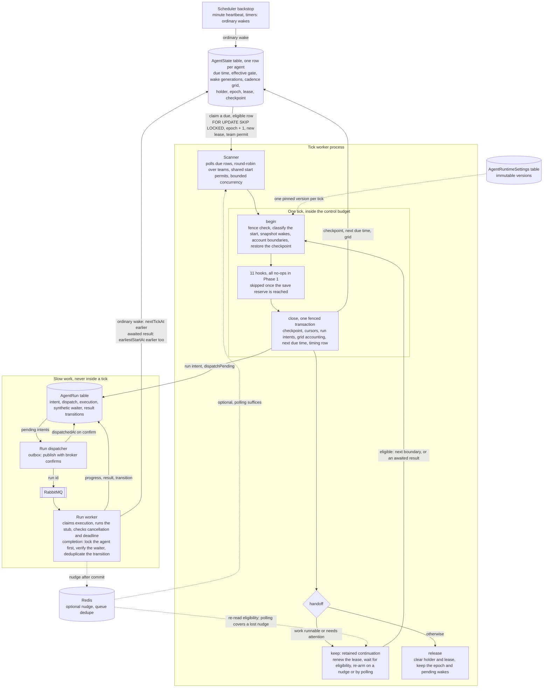

# Abe implementation plan

## Phase 1 - Ticks

A tick is a short step where the agent checks what has happened and decides what to do next.

When the agent is idle, nothing drives it. It waits for a wake. A minute heartbeat is the backstop, not the agent's
clock: if nothing has woken the agent for 60 seconds, it gets one tick to check whether anything needs attention, then
goes back to waiting.

```text
|--60s, no wake--| heartbeat tick |--60s, no wake--| heartbeat tick
```

The next due time is stored in `nextTickAt`.

Now, suppose the agent receives a notification. The process saving that notification also sets `nextTickAt` to an
earlier time, so the agent can respond before the next minute is up.

When the agent becomes busy, its ordinary ticks are scheduled five seconds apart:

```text
|--5s--| tick |--5s--| tick |--5s--| tick
```

These times are scheduling defaults. A worker still needs capacity and permission to start the tick, so a busy system
can start later. If it misses a scheduled tick, it records the miss and serves the latest due boundary. The grid stays
where it was; it is not re-anchored to the late start.

### What can bring a tick forward

There are two kinds of wake.

An **ordinary wake** means something may need attention: a notification arrived, a timer fired, or a background run
finished. It sets `nextTickAt` to an earlier time. An idle agent can then start a tick. A busy agent keeps its next
five-second boundary, even if many ordinary wakes arrive.

An **awaited result** means the agent's own work was waiting for a particular run to finish. Once the runtime verifies
that dependency, the result can trigger a tick before the next ordinary boundary.

For example, suppose an active agent has ordinary ticks at 0, 5 and 10 seconds. A run it is waiting for finishes at 2
seconds. The agent can tick then, handle the result, and still keep the ordinary tick at 5 seconds:

```text
0s                 2s                         5s                         10s
ordinary tick      awaited-result tick        ordinary tick              ordinary tick
```

The early tick is called an **additional start**. It leaves the ordinary schedule in place. An ordinary notification at
2 seconds would instead wait for the 5-second tick.

Two fields express that difference:

- `nextTickAt` says when the agent has work due.
- `earliestStartAt` says when it is allowed to start. An ordinary wake leaves this gate in place. A verified awaited
  result can lower it.

The next ordinary boundary is stored separately in `cadence.nextBoundaryAt`. Moving a due time or lowering the gate must
preserve that boundary.

### Mechanisms behind the tick

The scanner finds agents that are ready to run. A worker can also keep an agent after a tick and schedule its next start
directly. The scheduler backstop supplies minute heartbeats and timer wakes.

All three use the same durable state in PostgreSQL. A wake requests work; the worker that starts the tick must still
check ownership, timing, local capacity and the team's shared start limit.

#### The scanner

The scanner runs in a worker process. It polls PostgreSQL every 200 ms and looks for agent rows that meet four
conditions:

1. The row is `active` and the agent is `enabled`.
2. `nextTickAt` has arrived.
3. `earliestStartAt` has arrived, or there is no gate.
4. `leaseUntil` has expired, or nobody holds a lease.

The scanner claims a row before running it. A **lease** gives that worker temporary ownership. Other workers skip the
row while the lease is valid.

That gives the scanner four useful cases:

| Row state                                | What the scanner does                                   |
| :--------------------------------------- | :------------------------------------------------------ |
| Not due                                  | Leave it for later.                                     |
| Due, but leased                          | Let the current owner handle it.                        |
| Due and unleased, but the gate is closed | Wait until the allowed start time.                      |
| Due, unleased and gate open              | Claim it when capacity and a team permit are available. |

Workers choose teams round-robin. Within each team, newly found rows and agents already held by a worker compete fairly
for starts.

#### Keeping an agent between ticks

If the agent still has runnable work, or needs attention before the next scheduler pass, the worker can keep its lease
after the tick. This is a **retained continuation**.

The worker waits until the next allowed start and renews the lease while waiting. The wait uses no tick execution slot,
so one process can retain many agents.

A new awaited result may make the next tick eligible earlier. After saving the result and wake, the producer can send a
**nudge** to the current owner. The nudge tells the worker to read the row again and adjust its wait.

Nudges can be lost. Workers therefore poll their retained rows as well as scanning unleased rows. Start with the same
200 ms polling interval and measure its cost. A scanner that only reads unleased rows cannot recover a lost nudge for an
agent that another worker still holds.

A nudge never starts a tick by itself. The retained owner reads durable eligibility and joins the same permit queue as
the scanner. If a tick is already running, the new wake stays pending until that tick closes.

#### The scheduler backstop

The `tick_agent` job provides the minute backstop. It turns due heartbeats and generic timers into ordinary wakes. This
gives idle agents their periodic check and helps recover when a notification or worker is lost.

The job makes a bounded pass over due rows. It uses the existing scheduler and queue retry machinery. It does not drive
the five-second active cadence; the scanner and retained continuations do that.

#### Slow work

A tick has a small control budget. It starts slow work separately, then carries on without waiting for the result.

First, the tick saves an `AgentRun` record describing the work. That committed record is the **intent**. A dispatcher
reads pending intents and publishes run ids to RabbitMQ. A run worker claims the run and executes it.

When a step needs a run's result before it can continue, the runtime saves a record saying which step is waiting for
which run. This record is called a **waiter registration**. For example, a step that needs a document can register that
it is waiting for the run fetching that document.

When execution finishes, the run worker saves the result and wakes the agent in one transaction. It checks the saved
record to see whether the step still needs the result. If a step is still waiting for this run's result, the completion
can make the agent eligible to tick before its next ordinary boundary. A cancelled or replaced step no longer grants
that early tick. Completions from background runs without a waiting step use the ordinary wake path.

The tick worker and run worker have separate leases. A run can keep executing safely even if a different tick worker
takes over the agent.

### What this phase builds

Phase 1 builds this scheduling loop before adding agent behaviour. It includes agent state, claims, leases, bounded
ticks, checkpoints, slow-run dispatch, wakes, continuations, recovery, tests and timing metrics.

The tick has eleven named hooks for later behaviour. For now, each hook records that it ran and returns `no_change`.
Synthetic runs and waiter registrations let us test the scheduling rules without implementing tasks or calling a model
or tool. In Phase 1, the waiting steps and their registrations are test fixtures; real tasks come later.

Checkpoint contents remain opaque JSON. This phase saves and restores them without interpreting memory slots, versions,
priming or activation.

Perception belongs to later phases: Chapter 2's receptor, screening, interpretation and glances. Attention, recall,
memory, deliberation, procedures, tools, the notification tray and sleep also remain out of scope. So do tasks, live
search, simulation search, delegated child operations, the `evaluate` job, drives, identity refresh, observation stores
and a debugger UI.

Live search is the design's bounded read-and-decide run over a tool. Simulation search uses an isolated simulator
(design 7.10). Neither is needed to prove the tick mechanism.

The requirements come from `abe_design.md`:

| Design section | Requirement for Phase 1                                                                                                                                                                                                                                                                                                                                                |
| :------------- | :--------------------------------------------------------------------------------------------------------------------------------------------------------------------------------------------------------------------------------------------------------------------------------------------------------------------------------------------------------------------- |
| 1.4            | Give each tick 1,000 ms of control work, including 200 ms for saving. Schedule active ordinary ticks on a fixed 5,000 ms grid. Allow verified awaited results to start additional ticks while preserving that grid. Every start needs a valid lease, execution slot and team permit. Record missed boundaries, never replay empty ticks and never overlap valid ticks. |
| 3.4            | Save a checkpoint revision, update time and opaque contents. Restore the last committed checkpoint after restart or idleness.                                                                                                                                                                                                                                          |
| 8.1            | Commit checkpoint, synthetic cursors and intents consistently. Recover committed work and replay unfinished work safely. Leave unresolved execution `unknown`; a missing result does not authorise repeating an unknown effect.                                                                                                                                        |
| 8.5 and 10.3   | Save run records before dispatch. Give slow execution, cancellation, progress and timeout their own owner. Keep the agent scheduled while work is runnable or needs attention. A process-held call keeps its owning job alive. Release only after work and supervision have durable owners.                                                                            |
| 10.3           | Store the holder, an increasing epoch and lease expiry. Renew retained leases and check ownership before writes. Check work and wakes under the same lock used to release ownership. Keep the minute heartbeat as a backstop.                                                                                                                                          |
| 10.1           | Record scheduled time, missed starts, duration, control budget, save reserve, overrun and settings version, plus start cause and eligibility time.                                                                                                                                                                                                                     |
| 6.6            | Store timing and execution limits in immutable runtime settings versions.                                                                                                                                                                                                                                                                                              |
| 11.1 and 11.2  | Prove recovery and scheduling with fake clocks and injected failures. Deliver the tick portion of M1; the rest of M1 comes later.                                                                                                                                                                                                                                      |

All numerical settings and capacity estimates in this plan are starting defaults to test.

### How the parts fit together

PostgreSQL owns scheduling, checkpoints and execution state. RabbitMQ carries run jobs. Redis can carry nudges and
provide the existing queue's dedupe, but durable wake handling must work through PostgreSQL polling.

In the diagram, cylinders are PostgreSQL tables except for Redis. Dotted arrows show optional notifications.



### What happens during a tick

A tick begins by checking ownership and restoring the checkpoint. It runs the hooks while there is budget left, then
saves its state and decides whether to keep the agent or release it.

The skeleton is:

```text
begin
  restore the committed checkpoint
  load the pinned settings version
  establish the attempt, classify the start and acknowledge the snapshotted wakes
  reconcile generic execution ownership within the budget
  invoke beginContextHook

1.  Sense      → senseHook
2.  Perceive   → perceiveHook
3.  Predict    → predictHook
4.  Appraise   → appraiseHook
5.  Prime      → primeHook
6.  Attend     → attendHook
7.  Recall     → recallHook
8.  Select     → selectHook
9.  Act        → actHook
10. Observe    → observeHook
11. Regulate   → regulateHook

close
  commit the checkpoint and structural changes

continue
  keep the continuation scheduled, or perform the exit handoff
```

Every hook records its name, tick id, invocation and duration. If the budget prevents a hook from running, record
`skipped_budget`. `beginContextHook` is also a no-op: identity refresh, decay, drive updates and observation catch-up
come later.

Fixture adapters exercise the structural work around the hooks. They can create intents, deliver results, request
cancellation and change synthetic cursors. The production hooks themselves stay empty.

#### Claiming an agent

Before claiming, obtain a local execution slot and reserve a shared team start permit. The reservation is durable so
multiple workers cannot each spend the same team's capacity.

The scanner then claims one eligible row using explicit SQL. Supply the team, worker identity and lease TTL. Use the
`AgentState` model's generated table name for the statement below.

```sql
WITH candidate AS (
    SELECT "_id"
    FROM "agent_state"
    WHERE "active" = true
      AND "enabled" = true
      AND "teamId" = $1
      AND "nextTickAt" <= statement_timestamp()
      AND (
          "earliestStartAt" IS NULL
          OR "earliestStartAt" <= statement_timestamp()
      )
      AND (
          "leaseUntil" IS NULL
          OR "leaseUntil" < statement_timestamp()
      )
    ORDER BY "nextTickAt", "_id"
    FOR UPDATE SKIP LOCKED
    LIMIT 1
)
UPDATE "agent_state" AS agent
SET "holder" = $2,
    "epoch" = agent."epoch" + 1,
    "leaseUntil" =
        statement_timestamp() + ($3 * interval '1 millisecond'),
    "updated" = statement_timestamp()
FROM candidate
WHERE agent."_id" = candidate."_id"
RETURNING agent.*, statement_timestamp() AS claimed_at;
```

`FOR UPDATE SKIP LOCKED` lets a worker pass over a row another transaction already holds. The transaction ends as soon
as the claim finishes; the row lock is never held throughout the tick.

The claim records the **holder**, which is the worker process identity, and increments the **epoch**, which is the
ownership counter. It sets the lease expiry using database time.

Every tick-owned write later checks the holder, epoch and unexpired lease. This check is the **fence**. If another
worker has taken over, the old owner must fail the check and roll back every dependent write.

Claiming does not acknowledge a wake or advance the schedule. If the worker dies immediately, the row stays due and
becomes claimable when the lease expires. If the query returns no row, another worker may have won, the team may have no
eligible work, or its due rows may still be leased.

Keep both the due-time and earliest-start checks in the SQL. The claim reads the existing gate; it must not invent a new
cadence from `nextTickAt`.

Begin consumes the permit reservation once for its attempt. Release or expire unused reservations without counting a
start. Retained continuations reserve and consume permits through this same path.

#### Beginning the tick

Start the local monotonic budget immediately before sending a new claim, so claim latency uses part of the budget. For a
retained continuation, start a fresh budget just before its Begin transaction.

Begin locks the agent row, then any run rows needed to check eligibility. It verifies the holder, epoch, lease,
execution slot and team permit. If there is an unfinished attempt, recover it before replacing it. Remove obsolete or
consumed result entitlements and recheck that the agent is still eligible.

Then classify the start:

| Situation                                                                  | Start cause      | Scheduling effect                                                                                                               |
| :------------------------------------------------------------------------- | :--------------- | :------------------------------------------------------------------------------------------------------------------------------ |
| An ordinary boundary is due                                                | `cadence`        | Serve the latest due boundary. Record earlier unserved boundaries as missed. Include any eligible awaited results in this tick. |
| The agent is idle and has an ordinary wake                                 | `idle_wake`      | Start an active cadence segment at Begin. Include any pending awaited results in this tick.                                     |
| No ordinary boundary or idle wake is due, but a verified result is pending | `awaited_result` | Use the result's durable eligibility time as `scheduledAt`. Leave the ordinary grid in place.                                   |

An awaited result grants a single opportunity for an early start. This is its **entitlement**. Begin snapshots the
qualifying result transitions and marks their entitlements spent by this attempt.

Begin also snapshots both wake generations and their earliest timestamps. Each cause has an increasing **generation**,
so the worker can acknowledge what it saw without clearing a wake that arrives later.

Save the attempt, classification, boundary accounting, wake acknowledgement and permit consumption in one transaction.
The attempt id is the tick id. Clear pending timestamps only through the acknowledged generations, then recompute the
aggregate wake fields.

Store `eligibilityAt` separately from the actual start time. Preserve both causes' earliest wake timestamps on the
attempt and timing row, even when one tick handles both causes.

If settings changed, account for the old cadence segment first. Begin the new segment at this tick using its pinned
settings version. The tick must already be eligible under the existing gate: a settings change is not itself a wake.
Recovery uses the saved attempt and cursor, so it cannot spend an entitlement or count a boundary twice.

Finally, restore the checkpoint and inspect a bounded set of run records. Leave healthy run workers alone. If an
execution owner's lease expired, record the unresolved run as `unknown`. Losing a tick worker does not invalidate a
healthy run worker.

#### Keeping time for saving

The default control budget is 1,000 ms. Reserve the final 200 ms for saving, so the worker stops admitting hooks after
800 ms.

```text
deadline = monotonicStart + controlBudgetMs
admissionDeadline = deadline - saveReserveMs

for hook in orderedHooks:
    if leaseLost or monotonicNow >= admissionDeadline:
        record remaining hooks as skipped
        break
    invoke bounded hook
    check budget and lease again

closeAndHandoff(deadline)
```

Close is mandatory even if the last hooks, including `regulateHook`, are skipped. The budget limits the duration of
control work. The shared permit budget separately limits how often ticks can start.

Database calls need the remaining deadline too. Add a helper that bounds pool acquisition, lock waits, statements and
commit waits. If a write exceeds its deadline, cancel it or close the affected client. `Promise.race` alone leaves the
write running. Resolve an uncertain commit before retrying.

Keep synchronous work small or split it into bounded pieces that yield. A timer cannot interrupt blocked JavaScript. The
budget stops new work, but a runtime pause or stalled database can still cause an overrun.

#### Closing the tick

Use one transaction session for the close. Under the agent row lock:

1. Verify holder, epoch, unexpired lease and expected checkpoint revision.
2. Commit synthetic cursor changes, result consumption and new run intents.
3. Save the checkpoint with its next revision and database update time.
4. Account for unserved cadence boundaries crossed during execution and advance timer bookkeeping.
5. Remove entitlements for consumed results, including results that arrived after Begin. Preserve unrelated later wakes
   and their earliest timestamps.
6. Check runnable work, run ownership and pending wakes. Compute the next due time and decide whether to retain or
   release ownership.
7. Insert a timing row if the tick did more than routine bookkeeping or had an anomaly.
8. Set `lastClosedTickId`, clear `attempt` and commit.

Every dependent mutation belongs to this fenced transaction. If a fence check fails, return an error from the
transaction callback so the whole transaction rolls back. A successful callback with no matching row is not enough. Any
future early durable write must follow the same rule and remain consistent with its checkpoint.

Recompute `nextTickAt`, `earliestStartAt` and wake state from the locked row. Writing old copies with a bare `$set`
could erase a completion that arrived during the tick.

A result consumed in this tick leaves no early-start entitlement behind. A result whose entitlement was spent but which
has not been consumed remains ordinary runnable work. It cannot keep granting additional starts.

#### Keeping or releasing ownership

The final check and release happen under the same row lock used by close. This is the **handoff**.

Before releasing, verify that:

1. The lease and checkpoint revision still match.
2. The tick owns no slow call.
3. Every outstanding run has a durable dispatch retry, execution owner or recovery deadline.
4. Runnable structural work and pending wakes are accounted for.
5. The next timer, earliest start and heartbeat have an owner.

Keep a continuation if work remains runnable or needs attention before the next scheduler pass. Renew its lease
independently of the eligibility wait. Once eligible, it joins the fair permit queue; waiting reserves no execution
slot.

Otherwise, save the idle due time and clear `holder` and `leaseUntil` in the transaction. Keep the epoch.

After result consumption, recompute both wake causes. If pending state remains, set `nextTickAt` to the earlier of its
durable request time and the computed due time. Compute `earliestStartAt` from the ordinary boundary and earliest
surviving result entitlement. With no pending state, use the computed due time and gate.

A wake arriving before the lock is included in the handoff. One blocked behind the lock updates the row after the
handoff commits. It then nudges the retained owner or leaves an unleased row due for the scanner. Both paths preserve
the wake even if notification delivery fails.

### Keeping the cadence steady

Ordinary active ticks use a fixed grid. Finishing late does not move every later tick back.

For example, suppose the next tick was due at 10 seconds, with later boundaries at 15 and 20. If the worker can only
start at 22 seconds, it serves the 20-second boundary and records 10 and 15 as missed. It runs one tick.

An additional tick from 2 to 3 seconds leaves the ordinary boundary at 5. An additional tick from 4.8 to 5.2 seconds
crosses that boundary, so close records 5 as missed and leaves 10 as the next ordinary boundary. Another pending
completion may allow an early tick after close, but it cannot erase the missed boundary or move the grid.

The rules for updating the schedule are:

- While idle, use the earliest generic timer, supervision boundary or heartbeat. Keep any pending result entitlement and
  its eligibility time. The locked handoff ends active cadence accounting when the agent becomes idle.
- An ordinary wake from idle starts a new active segment at the actual Begin time.
- An awaited-result start alone leaves the anchor in place. If there is no active grid, use its result eligibility and
  leave ordinary timer and heartbeat scheduling intact.
- At an active Begin, serve the latest due ordinary boundary and record earlier unserved ones as missed.
- At an additional Begin, spend the snapshotted entitlements and leave the anchor and next ordinary boundary intact.
- At close, record every unserved boundary crossed during execution and advance the cursor once. Schedule the first
  future boundary unless another qualifying result is pending. Ordinary wake timestamps stay recorded but do not lower
  the active cadence gate.
- When cadence settings change, finish accounting for the old segment before beginning the new one. Preserve missed
  ranges with their original segment and spacing.

Persist accounting in Begin and close so recovery counts each boundary once. After a long outage, save exact missed
ranges rather than allocating one array entry per boundary inside the control budget. Report those ranges to timing rows
in bounded `missedStarts` batches, and clear a range only after its batches are written.

### Saving wakes without losing them

Save an event or result and its wake in one PostgreSQL transaction. Always lock the agent first, then the associated run
and registration state. Use database time for the wake.

For a completion, verify the run's execution fence and current waiter registration. The registration must match the run,
destination, synthetic step revision and dependency generation. The transition must still need handling. Failure,
cancellation and `unknown` can qualify if the waiting step must handle that outcome.

External events and unawaited background completions are ordinary. An external reply is ordinary even if a fixture is
waiting for it. A stale or superseded waiter grants no early-start privilege. The trusted runtime selects the cause;
result content and model output cannot select it.

Give every result transition a stable identity and persist its disposition once. A duplicate returns that saved
disposition without advancing a wake generation, lowering the gate or granting another entitlement. A later distinct
outcome, such as resolving `unknown`, needs a fresh check against a still-current waiter.

After verification and deduplication, run this update while holding the agent lock. `$2` is the trusted boolean for a
qualifying awaited result. Store the assigned wake generation and eligibility timestamp on the result transition in the
same transaction.

```sql
WITH wake_time AS (
    SELECT statement_timestamp() AS at
)
UPDATE "agent_state" AS agent
SET "nextTickAt" = LEAST(agent."nextTickAt", wake_time.at),
    "earliestStartAt" = CASE
        WHEN $2::boolean THEN
            CASE
                WHEN agent."earliestStartAt" IS NULL THEN wake_time.at
                ELSE LEAST(agent."earliestStartAt", wake_time.at)
            END
        ELSE agent."earliestStartAt"
    END,
    "wakePending" = true,
    "wakeRequestedAt" = CASE
        WHEN agent."wakeRequestedAt" IS NULL THEN wake_time.at
        ELSE LEAST(agent."wakeRequestedAt", wake_time.at)
    END,
    "ordinaryWake" = CASE
        WHEN $2::boolean THEN agent."ordinaryWake"
        ELSE agent."ordinaryWake" || jsonb_build_object(
            'generation',
            (((agent."ordinaryWake" ->> 'generation')::bigint + 1)::text),
            'earliestAt',
            LEAST(
                COALESCE((agent."ordinaryWake" ->> 'earliestAt')::timestamptz, wake_time.at),
                wake_time.at
            )
        )
    END,
    "continuationWake" = CASE
        WHEN NOT $2::boolean THEN agent."continuationWake"
        ELSE agent."continuationWake" || jsonb_build_object(
            'generation',
            (((agent."continuationWake" ->> 'generation')::bigint + 1)::text),
            'earliestAt',
            LEAST(
                COALESCE((agent."continuationWake" ->> 'earliestAt')::timestamptz, wake_time.at),
                wake_time.at
            )
        )
    END,
    "updated" = wake_time.at
FROM wake_time
WHERE agent."agentId" = $1
  AND agent."active" = true
RETURNING agent.*;
```

The cause counters are decimal strings in JSON, incremented with PostgreSQL `bigint` arithmetic. Each cause keeps the
earliest unacknowledged timestamp. Many wakes therefore coalesce into pending state rather than creating a tick for
every arrival. Begin can handle several result entitlements in one start.

This update leaves the ordinary boundary and cadence cursor in place. Only an awaited result lowers `earliestStartAt`.
Every claim and retained Begin still checks the gate and shared permit budget.

After commit, publish an optional nudge through `EldonPubSub`. The nudge asks the scanner or retained owner to reread
eligibility. Polling covers both kinds of owner when the nudge is lost.

### Durable state

Four new models hold the runtime state:

| Model                  | What it stores                                                                             |
| :--------------------- | :----------------------------------------------------------------------------------------- |
| `AgentState`           | One row per agent: due time, gates, wakes, cadence, lease, checkpoint and current attempt. |
| `AgentRun`             | A slow-run intent, dispatch state, independent execution ownership and result transitions. |
| `AgentTick`            | Timing and scheduling metadata for ticks that need a trace row.                            |
| `AgentRuntimeSettings` | Immutable versions of timing and execution limits.                                         |

#### AgentState

```typescript
type CheckpointEnvelope = {
    revision: number
    updatedAt: Date
    contents: unknown // JSON only; preserved without interpretation
}

interface AgentState extends EldonModelApi {
    _id: string
    agentId: string
    teamId: string
    enabled: boolean

    nextTickAt: Date
    wakePending: boolean
    wakeRequestedAt: Date | null // earliest unacknowledged wake
    ordinaryWake: { generation: string; acknowledgedGeneration: string; earliestAt: Date | null }
    continuationWake: { generation: string; acknowledgedGeneration: string; earliestAt: Date | null }

    cadence: {
        segmentId: string
        anchor: Date
        cadenceMs: number
        accountedThrough: Date | null
        nextBoundaryAt: Date
        active: boolean // false once ordinary idleness ends the segment; the whole object is null before any segment
    } | null
    missedStartRanges: {
        segmentId: string
        anchor: Date
        cadenceMs: number
        first: Date
        last: Date
        reportedThrough: Date | null
    }[]

    syntheticWaiters: {
        id: string
        runId: string
        stepId: string
        revision: string
        generation: string
        destination: string
        current: boolean
        handledTransitions: string[]
    }[] // fixtures only; registration and invalidation lock this agent row

    holder: string | null // unique worker process identity
    epoch: string
    leaseUntil: Date | null

    earliestStartAt: Date | null // effective gate: null while idle with no pending awaited result; a verified completion may lower it without changing cadence.nextBoundaryAt
    nextTimerAt: Date | null // generic timer boundary, not an expectation
    heartbeatAt: Date

    runtimeSettingsVersion: string
    checkpoint: CheckpointEnvelope

    attempt: {
        id: string
        scheduledAt: Date
        startedAt: Date
        runtimeSettingsVersion: string
        startCause: 'cadence' | 'idle_wake' | 'awaited_result'
        eligibilityAt: Date
        ordinaryWakeGeneration: string
        continuationWakeGeneration: string
        ordinaryWakeEarliestAt: Date | null // snapshotted at Begin, for latency by cause
        continuationWakeEarliestAt: Date | null
        resultTransitions: { runId: string; transitionId: string }[]
        cadenceSegmentId: string | null
        servedBoundaryAt: Date | null
        teamPermitId: string
    } | null

    lastClosedTickId: string | null
}
```

`active` is the inherited soft-delete flag. `enabled` is the pause switch: disabling an agent keeps its state but
prevents claims. A claim requires both flags.

There are two wake causes. `ordinaryWake` records ordinary wakes. `continuationWake` records awaited results; it is
named for continuing the agent's own work, and a start from it is classified `awaited_result`. It is not the same thing
as a retained continuation, which is a worker keeping an agent between ticks.

`wakePending` and `wakeRequestedAt` are compatibility aggregates derived from the two causes. Keep each cause's
generations and timestamps separately. `min(nextTickAt, now)` alone cannot protect a racing wake or express an awaited
result's earlier gate.

The cadence stores its own anchor, spacing and accounting cursor. `missedStartRanges` preserves exact unreported
boundaries across recovery and settings changes without one entry per miss.

Keep field ownership explicit:

| Fields                                                                                            | Writer                                                                                                                                     |
| :------------------------------------------------------------------------------------------------ | :----------------------------------------------------------------------------------------------------------------------------------------- |
| Identity, team, initial checkpoint, initial due times, empty wake states, cadence and waiter list | Provisioning.                                                                                                                              |
| `enabled`, `runtimeSettingsVersion`                                                               | Platform configuration.                                                                                                                    |
| `holder`, `epoch`, `leaseUntil`                                                                   | Claim, renewal and release code.                                                                                                           |
| Cause generations, timestamps and aggregate wake fields                                           | The trusted wake helper records arrivals; Begin acknowledges its snapshots; close removes consumed entitlements and recomputes aggregates. |
| `nextTickAt`                                                                                      | Wake producers move it earlier; the tick recomputes it at handoff.                                                                         |
| `earliestStartAt`                                                                                 | The fenced coordinator computes it; a verified completion may lower it.                                                                    |
| Synthetic waiter registrations and generations                                                    | Fixture registration and invalidation under the agent-first lock; close records handled transitions.                                       |
| Cadence, heartbeat, attempt and last closed tick                                                  | The fenced tick coordinator.                                                                                                               |
| `nextTimerAt`                                                                                     | Generic timer registration and acknowledgement.                                                                                            |
| Checkpoint envelope                                                                               | The fenced checkpoint transaction.                                                                                                         |
| `created`, `updated`                                                                              | Model helpers; explicit SQL maintains `updated` using database time.                                                                       |

Timer registration locks the agent and moves the due time earlier in the same transaction. Acknowledging a timer must
preserve another timer registered concurrently. Phase 1 exposes this contract through fixtures only.

Add these indexes:

- A unique index on `"agentId"`.
- A partial index on `("nextTickAt", "leaseUntil", "_id")` for active, enabled rows.
- A partial index on `("teamId", "nextTickAt", "leaseUntil", "_id")` for active, enabled team claims.
- An index on `"heartbeatAt"` for active, enabled rows.

Keep the existing fields and indexes. Check query plans with many future rows, held leases and due rows before relying
on the composite indexes for cheap scans.

#### AgentRun

```typescript
interface AgentRun extends EldonModelApi {
    _id: string
    agentId: string
    teamId: string
    requesterId: string
    kind: string // only "stub" is registered in Phase 1
    purpose: string
    inputs: { id: string; version: string | number }[]
    destination: string // opaque durable destination
    waiter: {
        registrationId: string
        stepId: string
        revision: string
        generation: string
        destination: string
    } | null
    wakeDisposition: 'ordinary' | 'awaited_result' | 'obsolete' // the latest transition's disposition
    resultTransitions: {
        id: string // stable transition identity, unique within this run
        receivedAt: Date
        waiterGeneration: string | null
        wakeDisposition: 'ordinary' | 'awaited_result' | 'obsolete'
        eligibilityAt: Date | null
        wakeGeneration: string | null
        entitlement: 'none' | 'pending' | 'spent' | 'consumed' | 'obsolete'
        acknowledgedByTickId: string | null
    }[]
    deadline: Date

    originTickId: string
    originAgentEpoch: string
    idempotencyKey: string

    status: 'intent' | 'queued' | 'running' | 'completed' | 'cancelled' | 'failed' | 'unknown'

    dispatchPending: boolean
    dispatchRetryAt: Date | null
    dispatchAttempts: number

    executionHolder: string | null
    executionEpoch: string
    executionLeaseUntil: Date | null

    cancelRequested: boolean
    cancelReason: string | null
    progressRef: string | null
    resultRef: string | null

    dispatchedAt: Date | null
    startedAt: Date | null
    externalCompletedAt: Date | null
    observedAt: Date | null
    consumedAt: Date | null
}
```

The tick creates immutable intent fields. The dispatcher owns publication bookkeeping. The run worker owns execution,
progress and results under its execution fence. The tick records consumption when the synthetic consequences commit.

Waiter linkage and wake disposition are trusted runtime metadata. A fixture may atomically attach a waiter to a suitable
existing run, using the agent-first lock order. Completion checks the current registration again before granting an
entitlement.

Persist each result transition and disposition once. Consumption marks the relevant transitions handled. An entitlement
already spent by Begin cannot be reused while its result waits for consumption.

Later, production tasks replace the synthetic registration source while keeping this contract. Search-child results will
wake their parent executor without opening the tick gate; that executor belongs to a later phase.

Add a unique index on `("agentId", "idempotencyKey")`, a pending-dispatch index ordered by retry time, an index on
`("agentId", "status")` and an index for expired execution leases.

Keep the result times distinct:

| Field                 | Meaning                                      |
| :-------------------- | :------------------------------------------- |
| `dispatchedAt`        | The broker confirmed publication.            |
| `externalCompletedAt` | Execution finished, when that time is known. |
| `observedAt`          | The runtime received the result.             |
| `consumedAt`          | The result's consequences committed.         |

#### AgentTick

```typescript
interface AgentTick extends EldonModelApi {
    _id: string
    agentId: string
    at: Date
    scheduledAt: Date
    missedStarts: Date[]
    startCause: 'cadence' | 'idle_wake' | 'awaited_result'
    eligibilityAt: Date
    ordinaryWakeGeneration: string
    continuationWakeGeneration: string
    ordinaryWakeEarliestAt: Date | null
    continuationWakeEarliestAt: Date | null
    cadenceSegmentId: string | null
    servedBoundaryAt: Date | null
    durationMs: number | null
    controlBudgetMs: number
    saveReserveMs: number
    overrunMs: number | null
    runtimeSettingsVersion: string
}
```

Use the tick id as the unique key and add an index on `("agentId", "at")`. A null duration or overrun means the process
died before final measurement. Wall-clock timestamps cannot reconstruct a monotonic duration.

Keep these rows limited to identifiers, timing and scheduling metadata. Hook invocations go in structured logs and
counters. Perception, memory, action and model trace fields come later.

#### AgentRuntimeSettings

```typescript
interface AgentRuntimeSettings extends EldonModelApi {
    _id: string // version

    controlBudgetMs: number // 1_000
    saveReserveMs: number // 200
    activeCadenceMs: number // 5_000
    scanIntervalMs: number // 200
    heartbeatIntervalMs: number // 60_000
    leaseTtlMs: number // 15_000
    leaseRenewIntervalMs: number // 5_000

    maxConcurrentTicksPerAgent: 1
    maxConcurrentRunsPerAgent: number // 4
    maxConcurrentTicksPerWorker: number // 2
    maxTickStartsPerTeamPerSecond: number // 250

    runTimeoutMs: number // 300_000
    runPrefetch: number // 1
}
```

Validate positive durations, `saveReserveMs < controlBudgetMs`, and enough lease time for renewal and saving. The limit
of one concurrent tick per agent is an invariant.

Each tick pins one immutable settings version. Apply changes at its next eligible Begin, after accounting for the old
cadence segment. A changed cadence starts a new segment and preserves earlier missed ranges. An awaited result alone
does not change settings or start a new segment.

The shared team limit covers cadence, idle-wake and awaited-result starts, including retained continuations.

#### Declaring the models

Declare each model in a `.model.server.ts` file using
`new EldonModel<Interface, ClientShape>({ name, schema, toClient, ... })`. Extend `EldonModelApi` in the interface. Use
`h/core/models/schedule.model.server.ts` and `eldon3/apps/abe/core/models/agent_task_run.model.server.ts` as examples.

The base model supplies `_id`, `active`, `created`, `updated` and ACL fields. Use those row timestamps. The checkpoint
has its own envelope timestamp, but the model needs no extra `createdAt` or `updatedAt` row fields.

`register(eldonDb)` builds the table specification from `name` and `schema`, registers generated `createTableSql(...)`
and expected columns, and exposes the model through `EldonModel.byName`. Use the generated `tableName`; a separate
table-name or `createSql` property does not belong in the declaration.

Explicit SQL must use generated column names. Ordinary fields retain names such as `"nextTickAt"`. ACL fields use
mappings such as `"acl_team_id"`; the runtime `teamId` field is separate.

Set `internal: true` with an id-only `toClient`. Platform creates use `{ internalObject: true }`. Platform reads and
mutations use `{ skipAclCheck: true }`, with a reason at the call site. Check agent/team bindings explicitly. Passing a
requester does not create an internal model's read policy. Later requester-facing models need declared `permissions`, as
`agentTaskRunModel` has now.

Map dates to `timestamptz` and opaque JSON to `jsonb`. Map epochs to PostgreSQL `bigint` and represent them as decimal
strings in TypeScript. Store wake generations as decimal strings inside their JSON cause objects too. Support these
lossless mappings in the table compiler, hydration and validation; a `STRING` or `NUMBER` schema declaration alone does
not establish a `bigint` mapping.

Declare ordinary fields with `DbFieldType.DATE`, `MIXED`, `STRING`, `BOOLEAN` and `NUMBER`. Agent references use
`DbFieldType.OBJECT_ID` with `ref: 'Agent'`. Preserve checkpoint JSON without interpretation. If the envelope is one
JSON value, encode and restore its timestamp explicitly.

Each model needs a deployment migration, including composite and partial indexes. `EldonDb.ensureSchema()` creates
missing local tables in development and tests; deployed environments validate schemas. Deploy migrations before starting
the workers.

#### Sharing a transaction between models and SQL

Use `model.startTransaction(async (session) => ...)` for work that mixes model calls and SQL. Pass
`{ session, ...accessOptions }` to every model call and use `session.client` for raw SQL. All participating sessions
must belong to the same database.

This wraps `EldonDb.withTransaction(callback)`, which obtains a `pg.PoolClient`, begins the transaction, commits a
successful callback, rolls back returned or thrown errors, and releases the client. The session closes when the
callback's transaction ends.

Raw SQL uses `eldonDb.query({ text, values }, { client })`. Model methods accept an `EldonTransactionSession`, rather
than a raw `pgClient`. For close, use `agentStateModel.startTransaction` and its single session throughout.

The current `findWithFixedStatement` accepts only `{ skipAclCheck: true }`; it is not the path for these transactional
writes.

### Wiring the workers

Keep the generic claim-loop lifecycle, clock interface, bounded execution helper and lease helper in `h/core`. Keep the
agent-specific SQL adapter, models, hooks, scheduling rules and job registrations in `eldon3/apps/abe`.

The runtime has these responsibilities:

| Component              | Responsibility                                                                                                    |
| :--------------------- | :---------------------------------------------------------------------------------------------------------------- |
| Tick worker            | Scan due rows, apply fairness, limit local concurrency and renew retained leases.                                 |
| Tick coordinator       | Check ownership, run the lifecycle and hooks, then commit the checkpoint and next due time.                       |
| Continuation scheduler | Read retained rows after nudges or polling, adjust waits and submit eligible agents to the shared permit queue.   |
| Wake helper            | Verify registrations, deduplicate transitions, record generations and lower the gate only for qualifying results. |
| Run dispatcher         | Publish committed intents with broker confirmations and durable retries.                                          |
| Run worker             | Execute the registered stub, save progress and results, and request durable wakes.                                |
| Scheduler backstop     | Turn due heartbeats and timers into ordinary wakes through existing schedule dispatch.                            |
| Exit handoff           | Check ownership and outstanding work under the row lock, then retain or release the agent.                        |

The coordinator invokes no model inference, tool or perception service. The run worker handles only the stub and never
writes working memory or advances agent steps.

#### Starting and stopping the scanner

Use the existing `startWorker` bootstrap. Start one scanner per worker process through a designated registration that
owns its lifecycle. The scanner runs independently of RabbitMQ deliveries.

Today, `startWorker` accepts `WorkerConfig.jobs` and optional `schedules`, and registers jobs in parallel. Before
attaching a listener, it calls the job's argument-free `onServerStart()` and stores the returned resource in
`QueueCtrlParams.serverData`. `onServerStop(serverData)` receives that resource later.

A startup failure is currently logged without aborting job registration. Scanner startup therefore needs to report an
unhealthy state and prevent claims when required resources are unavailable.

Supply database and dispatcher resources explicitly through bootstrap wiring. `QueueCtrlParams` provides `aiEngine`,
optional `pubsub` and `scheduler`, `sendToQueue`, `broadcastMessageToUser`, `sendToAppInstance` and `serverData`. It
provides neither a database client nor the queue manager. Lifecycle callbacks also receive no such parameters.

Keep a process-local registry of retained agent ids and lease identities. Route committed nudges to the current
continuation when available. Duplicate or stale nudges only cause a durable reread. A nudge received before the wait is
armed must still make the owner adjust that wait from the row's eligibility.

Batch retained-row polling within worker limits. Polling, nudges and scanning all submit to the same fair permit queue.
Lease renewal and run supervision continue independently of eligibility waits.

Shutdown must stop new claims and submissions, drain the dispatcher, and finish bounded closes before queue teardown.
Then transfer or release responsibility through the handoff and close scanner and continuation resources. The current
shutdown path closes the queue manager before invoking job stop hooks, so add lifecycle support for this ordering.

#### Registering jobs, models and schedules

Register `tick_agent` as the bounded wake/backstop adapter and add a separate stub-run job in `jobs.ts`. Put job names
in `constants.server.ts`. Export the new models from `core/shared/models.server.ts` and include them in the worker's
`models` array.

Declare the backstop in `WorkerConfig.schedules`, using a registered job name and `EldonScheduleType.INTERVAL` with
`everyMs: 60_000`. Choose its payload and bounded scan batch during implementation.

After registering jobs, `startWorker` calls `scheduler.create`. Creation reuses an active schedule with the same name,
payload and owner. Ownerless declarations become system schedules.

The Abe worker currently declares only the hourly memory-consolidation schedule and passes no `redisUrlstring`.
Configure that option where the deployment needs Redis-backed scheduler election and queue dedupe.

#### Database support

Claims need explicit SQL for `SKIP LOCKED` and database-time lease expressions. The current
`findOneAndUpdate(query, update, options)` can perform an ordered conditional update, supports `upsert` and `session`,
and can join the caller's transaction. Its selection uses plain `FOR UPDATE` inside `withClient`, which could make
workers wait behind the same busy row.

The control budget also needs new deadline support. Today, `EldonDb.query` accepts a statement and optional client,
while `withTransaction` accepts only its callback. Neither provides a deadline or cancellation option. Add bounded
database execution to these paths and propagate the remaining budget through the helper described above.

### Dispatching slow runs

The run row acts as the durable **outbox**: the dispatcher can always find committed work that still needs publication.

The sequence is:

1. The tick commits an `AgentRun` in `intent` with `dispatchPending = true`.
2. The dispatcher publishes its id to the registered RabbitMQ job.
3. After broker confirmation, the dispatcher records `dispatchedAt` and clears the pending flag.
4. The worker validates the payload and hydrated requester/team, then checks the run's agent/team binding.
5. The worker atomically claims execution. An already owned or terminal run cannot be claimed by a duplicate delivery.
6. The stub executes in bounded chunks, checking cancellation and its deadline between chunks.
7. The worker locks the agent, then the run, and verifies its execution fence. It saves the result transition, checks
   the current waiter and assigns the trusted wake disposition in one transaction. An awaited result lowers due time and
   the gate; an ordinary completion lowers only due time. A duplicate transition grants nothing new.
8. A later tick commits result consumption and `consumedAt` together with the synthetic consequences.

#### Broker confirmations and retries

Add a confirm-backed publication path in `h/core/library/database/eldon_queue.ts` and wire the dispatcher to it
explicitly. `dispatchedAt` must mean confirmed publication.

Today, `EldonQueueManager.send(queueName, envelope, { sendToQueueMaxRetries })` uses an ordinary `amqp.Channel`, sets
`persistent: true`, writes `x-max-retries`, and returns after `channel.sendToQueue`. It does not wait for broker
confirmation. The boolean return describes buffer backpressure; a false return does not establish that the message was
never sent.

`sendToQueueMaxRetries` defaults to zero. It controls the retry header, rather than retrying the publisher call.
Publication retries belong in the durable outbox, with a retry time and the same run id.

`QueueCtrlParams.sendToQueue(name, data, context)` checks requester quota, accepts `requester`, `teamid` and
`skipQuotaCheck`, and constructs the envelope with `created: Date.now()`. It exposes no idempotency key, retry count or
confirm option, so the dispatcher needs the new publication path.

If publication succeeds but the confirmation is lost, retrying may publish twice. The PostgreSQL execution claim
provides durable dedupe. A committed intent can be retried; an uncommitted intent must never be published.

#### Message identity and hydration

Queue envelopes carry `data`, a typed `requester: Principal`, `teamid`, `created` and an optional `idempotencyKey`.
Establish the requester's actor type from trusted provisioning or registered identity records. A requester id alone
cannot construct a principal. Require both requester and team on stub-run messages.

When both identities are present, `startWorker` loads `jobInfo.principal` and `jobInfo.team`. It rejects missing
identities or invalid membership before calling the handler. User requesters load through `userModel`; other actor types
load through `EldonModel.byName(requester.type)`. The handler must still check the run binding after hydration.

Declare a payload schema for the stub's run id. The current queue consumer is
`listen(queueName, callback, { prefetch, payloadSchema, pubsub })`, with prefetch one by default. Its one-hour Redis
dedupe covers initial deliveries with an idempotency key. Retries bypass it, and deliveries after expiry can recur. The
run's database state must therefore protect execution regardless of queue dedupe.

#### Independent execution ownership

Give each run its own holder, epoch and lease. Its `originAgentEpoch` records which valid intent authorised dispatch. A
later tick-worker takeover leaves a healthy run's execution ownership intact.

Accept a completion according to the run execution fence and the current waiter registration. A different current agent
epoch alone is no reason to reject it. An expired run owner cannot publish an accepted result. Stale waiters keep their
recorded result but grant no early start.

Run workers write only their execution records and wake requests. Keep cancellation requests distinct from terminal
outcomes: requesting cancellation does not prove execution stopped.

Start run consumers with `prefetch: 1` and a job timeout aligned with the run deadline. `startWorker` currently wraps
handlers in `withTimeout(jobConfig.timeoutMs)`. The stub still owns its durable deadline, execution lease and
cancellation checks.

The stub supports delayed completion, saved progress, cancellation, failure and lost-response fixtures. It calls no
model or tool.

#### Later search execution

Live-search workers will need a bounded parent authorisation and the shared runner for every child call. Each child must
atomically validate its basis and save its intent, checking current scope, task and ancestor revisions, policy, grants,
authorisation tuple and lease. After takeover, delegated execution authority must be adopted or renewed before more
children are dispatched.

Those workers may not write working memory or advance task steps. These are prerequisites for the later search phase;
Phase 1's stub worker implements none of that execution.

### Integrating the scheduler and Redis

Reuse the scheduler for the minute backstop, with its existing dispatch limits and recovery behaviour. Keep its
scheduling separate from active tick cadence and agent ownership.

#### Scheduler behaviour to account for

The scheduler defaults to a 60,000 ms polling interval, `TICK_BATCH_LIMIT = 1000` and
`MAX_FIRES_PER_TICK_PER_TEAM = 100`. Its query uses `ROW_NUMBER()` partitioned by `"acl_team_id"`, taking up to 100 due
schedule rows per team before the global limit. Ownerless schedules share a system bucket. Excess rows remain due. These
limits bound schedule dispatch; the tick workers use their own concurrency and shared permit limits.

For ordinary jitter, scheduler interval advancement uses the previous due time. If a delay exceeds one interval, it
advances to `now + everyMs`. Active ticks need exact fixed-grid accounting, so do not use `computeNextRunAt` for their
cadence.

`runScheduledTick` acquires `scheduler.tick.lease` through `setIfAbsentWithTTL` with a 30-second TTL. During its batch,
`tickOnce` tries to renew every 15 seconds with unconditional `setWithTTL`. The value is a timestamp breadcrumb; it has
no checked ownership token. Agent leases therefore need their own PostgreSQL fence. `isTicking` prevents scheduler
overlap within one process. Without configured pubsub, the scheduler dispatches directly for single-worker use.

Scheduled jobs are sent through `queueManager.send`, bypassing requester quota. Dispatch includes the owner principal
and team when present, an idempotency key of `{scheduleid}:{nextRunAtMs}`, and the schedule's `maxRetries`, default ten.
After send returns, the scheduler records `lastDispatchedAt` and advances `nextRunAt` conditionally on the old due time.
That marker prevents another send when advancement alone failed. Run intents use the new broker-confirmed outbox.

Successful handlers reset `consecutiveErrors`. Final failures from the error-queue listener increment the count and
disable the schedule at ten. Monitor the heartbeat schedule's enabled state as well as due agent rows.

#### Optional Redis coordination

`EldonPubSub` currently provides `setIfAbsentWithTTL`, `setWithTTL`, `get`, `delete`, `claimOwnership`,
`deleteIfEquals`, `refreshIfEquals` and `incrementWithTTL`. Acquisition returns `wasSet`, conditional renewal returns
`refreshed`, and conditional deletion returns `removed`.

These primitives can support optional Redis coordination. Choose a nudge channel and publication adapter explicitly;
those method signatures alone do not define a publish/subscribe contract.

If Redis is unavailable, PostgreSQL polling still preserves wakes and leases. With pubsub configured, the existing
scheduler skips dispatch when Redis is disconnected or lease acquisition fails, and queue dedupe is unavailable.
Retained-owner polling must continue alongside scanning unleased rows.

### Recovery when something fails

#### Overrun or lease loss

If a tick overruns, stop admitting work and stop renewing that attempt's lease. While ownership remains valid, make a
bounded close attempt and record `max(0, durationMs - controlBudgetMs)`. If close cannot finish, keep the last committed
checkpoint and let ownership expire.

On lease loss, stop immediately and discard local changes. The old epoch cannot dispatch or retry state writes. The next
owner recovers committed work.

An epoch prevents stale writes from being accepted. It cannot stop a paused process from later resuming CPU work, so
resumed code must check its fence before useful work. Preventing overlap means one valid owner and no concurrent
accepted agent mutations.

#### Failure cases

| Failure                                       | Recovery                                                                                                                                |
| :-------------------------------------------- | :-------------------------------------------------------------------------------------------------------------------------------------- |
| Crash before checkpoint commit                | Restore the prior checkpoint. Recover the unfinished attempt and cadence cursor; replay unfinished structural work with stable ids.     |
| Intent commits, then dispatcher crashes       | The pending-dispatch scan publishes the saved intent.                                                                                   |
| Publication succeeds but confirmation is lost | Retry with the same run id. The execution claim prevents duplicate accepted execution.                                                  |
| Dispatch attempted before the run row commits | Reject the ordering: the dispatcher can publish only committed rows. Test that rollback leaves no runnable job.                         |
| Run worker dies during execution              | Once its ownership expires, mark unresolved execution `unknown`. Keep unknown effects from being automatically repeated.                |
| Tick worker dies holding a lease              | Let the lease expire and claim with a higher epoch.                                                                                     |
| Workers race to claim                         | Row locking selects one owner. Reject all dependent writes from an older epoch after takeover.                                          |
| Commit response is lost                       | Read `lastClosedTickId` and durable run ids to establish whether commit succeeded before replaying.                                     |
| Redis fails                                   | Continue PostgreSQL polling and fenced wake handling. Account for unavailable queue dedupe and skipped Redis-backed scheduler dispatch. |
| RabbitMQ fails                                | Keep intents pending with durable retry times. Track their age while ticks continue. Broker waits happen outside the tick budget.       |
| PostgreSQL slows down                         | Stop admission, enforce bounded database waits, record overruns where possible and preserve committed state.                            |
| Worker clocks differ                          | Use database time for due times, lease expiry and wakes; use monotonic time for local duration.                                         |
| Cancellation races with completion            | Preserve the actual terminal result. A request to cancel is not a terminal result.                                                      |
| Shutdown cannot finish                        | Stop claims and attempt bounded closes and safe releases. Unfinished ownership expires.                                                 |
| Completion is delivered twice                 | Return its saved disposition without another generation or entitlement.                                                                 |
| Nudge is lost or arrives before wait setup    | Poll retained rows, adjust waits from durable eligibility and enter the shared permit queue.                                            |
| Completion races with Begin or close          | Preserve later generations through agent-first locking and snapshots. Consumption removes only its own entitlements.                    |
| Waiter is stale                               | Record the result without an early-start grant. Result content cannot restore eligibility.                                              |
| Agent takeover happens during a healthy run   | Keep the independent execution owner and check the current waiter when the result arrives.                                              |
| Team limit delays an eligible result          | Preserve cause, timestamp, entitlement and work budget. Retry fairly while keeping the cadence anchor.                                  |

### Capacity and fairness

Start with 1,000 continuously active agents and a five-second ordinary cadence. The cadence-only estimate is:

```text
1,000 / 5 = 200 ticks per second
200 × 0.050 seconds = 10 worker-seconds per second
```

Assuming 50 ms of occupied execution time per tick, start load testing with 10 to 15 tick-worker processes. Then add
measured awaited-result and idle-wake starts and recalculate. The 200 ordinary starts per second are only part of total
demand when agents are engaged in work.

Measure CPU, database time, event-loop delay, retained-owner polling and lease-renewal traffic separately. Bound
simultaneous tick bodies separately from the number of retained agents. A sleeping continuation takes neither a process
nor an execution slot of its own.

The scanner has no RabbitMQ prefetch; limit its local concurrency. Short wake-adapter jobs may use higher prefetch.
Slow-run consumers start at one.

Idle agents keep rows and index entries. Use shared indexed scans rather than reading every idle row on every poll. A
thousand idle agents with minute heartbeats average about 17 heartbeat checks per second.

#### Sharing starts across teams

Before every start, choose teams round-robin and arbitrate fairly within a team between scanned rows, retained
continuations and other agents. Reserve starts in one shared PostgreSQL budget. Start with 250 starts per team per
second and test that adding workers cannot multiply the cap.

If one team uses 200 starts per second for ordinary cadence, roughly 50 remain for additional and idle-wake starts,
assuming every ordinary boundary is served. Measure fairness during bursts and sustained work.

Throttling may delay a tick, but it must preserve the wake, eligibility time, entitlement and cadence anchor. It must
also preserve task and run budgets. Track the age of eligible work so overload stays visible.

Beyond 10,000 active agents, evaluate partitioning or sharding by team after measuring the database. Keep each agent's
state, runs, checkpoint transaction and fairness budget together.

### Tests

Use fake wall and monotonic clocks for pure tests, real PostgreSQL for transactional tests, and PostgreSQL with RabbitMQ
for queue tests. Include Redis wherever the existing queue or scheduler requires it.

Group tests by the behaviour they prove.

#### Tick lifecycle and timing

| Test                    | Environment         | What it proves                                                                                 |
| :---------------------- | :------------------ | :--------------------------------------------------------------------------------------------- |
| Hook order              | Pure                | Begin, all eleven hooks, close and continue run in order. Excluded behaviour is never called.  |
| Opaque checkpoint       | Pure and PostgreSQL | Arbitrary JSON survives close, idle exit and restart unchanged.                                |
| Save reserve            | Pure                | Admission stops before the reserve; mandatory close still runs.                                |
| Overrun                 | Pure and PostgreSQL | Delayed queries produce measured overruns, stop renewal and admit no further hooks.            |
| Missed starts           | Pure and PostgreSQL | Late starts and long outages preserve exact boundaries without cadence drift.                  |
| No catch-up loop        | Pure                | Jumping across boundaries runs one current tick.                                               |
| Settings versions       | Pure and PostgreSQL | A tick keeps its pinned version. Changes apply at the next Begin after old-segment accounting. |
| Clock skew              | Pure and PostgreSQL | Worker wall-clock offsets affect neither lease decisions nor measured duration.                |
| Empty trace suppression | PostgreSQL          | Routine no-op ticks increment counters. Missed starts and overruns still create timing rows.   |

#### Ownership and handoff

| Test                      | Environment             | What it proves                                                                                                                         |
| :------------------------ | :---------------------- | :------------------------------------------------------------------------------------------------------------------------------------- |
| Claim race                | PostgreSQL              | Concurrent workers get one valid lease for an agent.                                                                                   |
| Skip locked               | PostgreSQL              | A locked candidate does not block other claims.                                                                                        |
| Lease expiry and takeover | PostgreSQL              | A dead owner expires and the new owner gets a higher epoch.                                                                            |
| Stale epoch               | PostgreSQL              | The old owner cannot change checkpoint, cursor, intent or due-time state.                                                              |
| Wake during exit          | PostgreSQL              | Wakes before, during and after release remain claimable.                                                                               |
| Wake during takeover      | PostgreSQL              | Takeover preserves wakes it has not acknowledged.                                                                                      |
| Checkpoint crash          | PostgreSQL              | Cursors, consumption, intents, checkpoint and due time commit or roll back in the same session.                                        |
| Unknown commit            | PostgreSQL              | Durable tick identity resolves a lost commit response before retry.                                                                    |
| Independent run takeover  | PostgreSQL and RabbitMQ | A healthy run completes after agent takeover and checks its current waiter. An expired execution owner cannot save an accepted result. |

#### Wakes and additional starts

| Test                           | Environment             | What it proves                                                                                                                                                             |
| :----------------------------- | :---------------------- | :------------------------------------------------------------------------------------------------------------------------------------------------------------------------- |
| Coalescing wakes               | PostgreSQL              | Repeated wakes retain pending state and the earliest request time.                                                                                                         |
| Ordinary flood                 | Pure and PostgreSQL     | External wakes and background completions without registered waiters create no additional starts. A tick enabled by an awaited result may still handle them.               |
| Awaited-result eligibility     | Pure and PostgreSQL     | A current waiter permits an early start, subject to lease, slot and permit. Failure, cancellation and `unknown` qualify only when the step must handle them.               |
| Waiter validation              | PostgreSQL              | Stale revisions, superseded generations and wrong destinations grant nothing. Payloads cannot choose causes. A waiter can attach atomically to a suitable in-flight run.   |
| Background and external causes | Pure and PostgreSQL     | Background runs without waiters and external replies remain ordinary, including replies awaited by a task fixture.                                                         |
| Ordinary grid                  | Pure and PostgreSQL     | Early ticks leave the next boundary in place; crossing one records it missed. A due boundary coalesces result eligibility. Settings and recovery count each boundary once. |
| Duplicate transition           | PostgreSQL and RabbitMQ | Replays before or after consumption grant nothing new. An unconsumed result with a spent entitlement cannot repeatedly start early ticks.                                  |
| Retained continuation          | PostgreSQL              | Nudge or polling adjusts an early-result wait. Cover lost, duplicate and stale nudges, nudges before wait setup and Redis failure while leased.                            |
| Completion races               | PostgreSQL              | Arrivals around Begin, close, consumption and release remain durable. Same-tick consumption clears its entitlement while preserving unrelated later wakes.                 |

#### Dispatch and execution

| Test                         | Environment                           | What it proves                                                                                                                                                             |
| :--------------------------- | :------------------------------------ | :------------------------------------------------------------------------------------------------------------------------------------------------------------------------- |
| Completion after tick exit   | PostgreSQL and RabbitMQ               | The saved result wakes a later tick after the tick worker exits.                                                                                                           |
| Duplicate job delivery       | PostgreSQL and RabbitMQ               | Publication retries and redelivery produce one accepted execution, including after Redis dedupe expires and when retries bypass it.                                        |
| Intent before dispatch       | PostgreSQL and RabbitMQ               | Rollback leaves no job. Committed intents survive publisher failure. Only broker confirmation clears pending dispatch, including backpressure and lost-confirmation cases. |
| Cancellation and owner death | PostgreSQL and RabbitMQ               | The stub checks cancellation between chunks. Unresolved execution becomes `unknown`.                                                                                       |
| Scheduler backstop           | PostgreSQL, RabbitMQ and Redis        | Recovery handles a lost nudge without duplicate active loops. Scheduler lease races and repeat deliveries cannot bypass claims.                                            |
| Redis outage                 | PostgreSQL with Redis fault injection | Polling and durable handoff continue while the Redis-backed scheduler skips dispatch.                                                                                      |

#### Fairness and load

| Test                      | Environment       | What it proves                                                                                                                                                                      |
| :------------------------ | :---------------- | :---------------------------------------------------------------------------------------------------------------------------------------------------------------------------------- |
| Team fairness             | PostgreSQL        | Workers share the cap; a flooded team cannot starve another.                                                                                                                        |
| Capacity soak             | Full stack        | Active and idle load has bounded queues and measured recovery after faults.                                                                                                         |
| Additional-start fairness | Full stack        | Bursts and sustained work share capacity with ordinary starts and other agents. Throttling preserves eligibility and budgets; valid ticks never overlap.                            |
| Scheduling comparison     | Synthetic harness | Compare cadence-only and awaited-result scheduling under external and background floods, completion bursts, sustained work, stale waiters, lost nudges, handoff races and overload. |

The comparison proves scheduling behaviour using synthetic work. Live search, tasks, delegated operations and model
evaluation remain outside this harness.

### Metrics and timing traces

Count every start and close, including empty ticks. Record:

- Starts per second by `cadence`, `idle_wake` and `awaited_result`, split between new claims and retained Begins. Count
  completed, empty, interrupted and failed ticks, plus tick rate for synthetically engaged agents.
- Claim latency, claim misses and due-to-start delay.
- Control budget use, save time, overrun count and duration.
- Missed starts and the oldest unserved ordinary boundary.
- Wake-to-start latency by cause, preserving both earliest timestamps when causes coalesce. Measure wake-to-claim for
  new owners and wake-to-Begin for retained owners.
- Lease renewals, failed renewals, takeovers and rejected stale writes.
- Run queue depth, pending-dispatch age, unknown runs and completion-to-consumption delay.
- Team throttling and oldest eligible work per team.
- Hook invocations and budget skips by name.

An empty tick runs no-op hooks and routine bookkeeping. Count it without creating an `AgentTick` row. A missed start,
overrun, recovery, synthetic intent or result transition makes it non-empty.

Timing rows hold identifiers and timing/scheduling fields, including cause, eligibility, generations, cadence segment
and served boundary. Use logs for stub hook invocations. Record nudge recovery, duplicate transitions, obsolete waiters
and permit delay in operational diagnostics.

Insert a needed timing row in the close transaction. Once close is acknowledged, update duration by tick id through an
idempotent telemetry write. If saving turns an empty tick into an overrun, insert its timing row then. Telemetry updates
must never change agent state.

If the process dies before finalisation, leave duration unknown. Report trace-write failures so a database outage does
not appear to have complete timing data.

Later search phases add searches and resumptions per task, tool and evaluator calls per search, total task calls, cost,
coverage, interruption delay and required-observation delay. Phase 1 measures scheduling and synthetic result
consumption only.

### Implementation order

1. In `eldon3/apps/abe/core/tick/`, add clocks, structural contracts and the pure fake-clock harness.
2. In `eldon3/apps/abe/core/models/`, add immutable runtime settings and validation through `EldonModel`, using
   inherited metadata. Add deployment migrations.
3. Add `AgentState`, its checkpoint, cadence, wake generations, waiter fixtures, provisioning and indexes in the same
   model directory and migrations. Support lossless epochs and generations in compilation and hydration.
4. In `h/core/worker/` and `h/core/library/database/eldon_db.ts`, add scanner lifecycle, lease helpers, shutdown
   ordering and deadline support.
5. In `eldon3/apps/abe/core/tick/`, add claim SQL, renewal, fence checks and PostgreSQL race tests.
6. Add cadence accounting, start classification, budget enforcement and the eleven no-op hooks. Add retained
   continuations, notification handling, wait adjustment and polling fallback.
7. Add close through a shared `EldonTransactionSession`, trusted wake classification, gate reduction, generation
   snapshots, generic timers and handoff tests. Cover completion/close races and same-tick entitlement removal.
8. In `eldon3/apps/abe/core/models/` and migrations, add `AgentRun`, intents, waiter linkage, trusted dispositions and
   idempotent result transitions.
9. In `eldon3/apps/abe/jobs/` and `h/core/library/database/eldon_queue.ts`, add the dispatcher, broker-confirmed
   publication, stub job, completion wake, cancellation and unknown-run recovery.
10. In `eldon3/apps/abe/jobs/` and `h/core/scheduler/`, add the bounded heartbeat adapter through
    `WorkerConfig.schedules`.
11. In the Abe model and tick directories, add timing rows, cause and eligibility fields, bounded missed-start
    reporting, hook logs and metrics separating claims from retained starts.
12. In `h/core/worker/` and deployment migrations, add the durable team permit reservation table and fairness tests.
13. Wire the flag, models, scanner, dispatcher, continuations, jobs, schedules and Redis configuration through
    `eldon3/apps/abe/jobs/server.ts`, `eldon3/apps/abe/jobs/jobs.ts`, `eldon3/apps/abe/jobs/constants.server.ts` and
    `eldon3/apps/abe/core/shared/models.server.ts`.
14. Add the crash, outage, duplicate-delivery, waiter, nudge, cadence, takeover, handoff, capacity and result-burst
    fixtures under `eldon3/apps/abe/`. Include the synthetic scheduling comparison.
15. Add cohort configuration and a runbook, run the shadow rollout, record results and document rollback.

### Rollout

Ship behind `abeTicks`, off by default. Deploy schemas and migrations first, then provision rows only for the test
cohort and start scanners.

Run shadow ticks beside the existing `run_agent_task` and `respond_to_conversation_message` paths. Give them synthetic
wakes and stub runs. Keep the existing handlers, dispatch paths and outputs unchanged; shadow ticks consume no
conversations, task inputs or observations.

#### Keeping the existing task path separate

The new generic `AgentRun` and stub job have their own execution path. The existing `runAgentTaskJob` in
`jobs/jobs/run_agent_task/run_agent_task.job.ts` keeps its current behaviour:

- Its timeout is five minutes and its prefetch defaults to one.
- `RunAgentTaskJobData` carries exactly one of `runid` or `taskid`. The schema validates UUIDs and the handler enforces
  the exclusive choice.
- Manual jobs load a precreated `AgentTaskRun`. Scheduled jobs load a task and skip successfully if its latest run is
  `IN_PROGRESS`; otherwise they create a scheduled task run inside the handler.
- The handler requires `jobInfo.requester` and hydrated `jobInfo.team`. It uses the requester for model access, gathers
  integration tools, saves status, calls `runAgent`, creates an artifact and broadcasts updates.

Keep its `taskid`, `agentid`, `instructions`, `sequence`, `startMs` and `endMs` fields separate from the generic run
contract.

#### Promoting the cohort

Start with deterministic failure scripts. Then use real PostgreSQL and RabbitMQ for mixed active and idle load,
synthetic waiters, completion bursts and sustained work. Inject shutdowns, process pauses, broker outages, database
delays, duplicate deliveries, stale waiters and lost retained-owner nudges. Place completions around every Begin,
consumption and handoff boundary.

Promote only when:

- All Phase 1 correctness tests pass and stale owners commit no state.
- Durable wakes recover after service failures, including lost nudges for retained owners.
- Checkpoint recovery preserves committed synthetic work.
- Intent publication survives crashes with one accepted execution.
- Slow runs have explicit execution owners and leave ticks free to proceed.
- Missed starts, overruns and pending work stay visible under overload.
- Measured load meets the agreed latency and capacity targets.
- Existing task and conversation behaviour is unchanged.
- Ordinary floods create no additional starts, and awaited results preserve the ordinary grid.
- Duplicate transitions and consumed results leave no reusable early-start entitlement.
- Result bursts share the team cap fairly, without stranded wakes or reset budgets.

These satisfy the bounded-loop and handoff checks in design **11.2 M1**. Completing M1 also needs tasks, action-basis
checks, resource fencing, perception, the tray, B0 and the timeline in later phases.

#### Rolling back

Disable new claims and new stub dispatch. Drain or cancel owned runs, finish active ticks and keep durable rows for
inspection and recovery. Rollback preserves state.

### Decisions to measure or settle

- **Load and latency.** Start with 1,000 active agents and 200 ordinary starts per second. Add measured additional and
  idle-wake demand under the shared cap. Test a healthy-load p95 idle wake-to-start target below one second. Set
  separate targets for active ordinary wakes, awaited results, new claims and retained starts. Measure overload and
  sustained work separately.
- **Deployment.** Start with a separate tick-worker deployment using `startWorker`. Scale run consumers independently.
- **Execution limits.** Start with the runtime settings above. Revise them through new versions after capacity and fault
  tests.
- **Trace retention.** Start with seven days in PostgreSQL, then archive timing rows. Sleep and episode compaction come
  later.
- **Continuation notification.** Choose the nudge channel and publication adapter, retained-row polling batch size and
  measured fallback interval. Durable eligibility, polling coverage and the shared permit path are required.
- **Search limits.** Design 7.10 and 8.1 define later task, live-search, delegated-child and evaluation contracts.
  Numerical search limits, evaluator quality and active-time charging need later-phase measurements.
